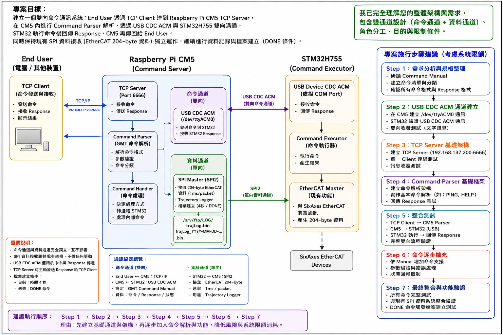
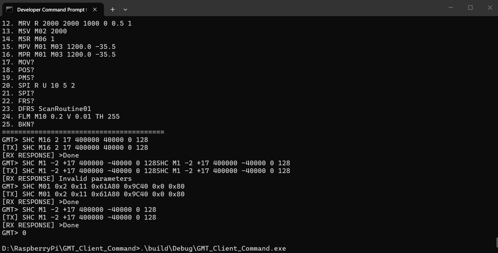
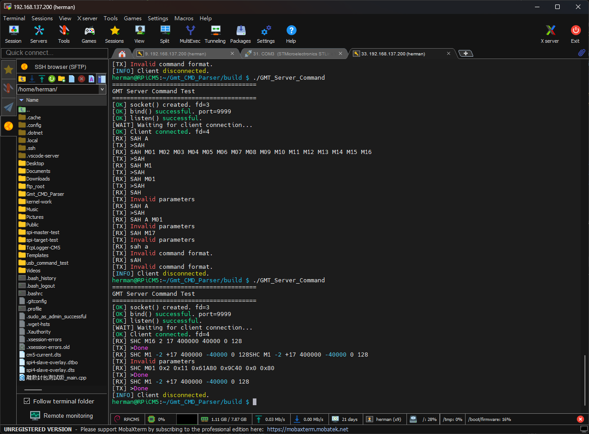

# Gmt_CMD_Parser

GMT SixAxes Controller TCP/IP Command Parser

---

## 1. Project Overview

`Gmt_CMD_Parser` is the command communication and parsing system running on the Raspberry Pi CM5 for the GMT SixAxes Controller motion system.

The project is designed to provide a layered communication path between an external user/host application and the STM32H755 EtherCAT Master.

The overall system is:

```text
                         End User
                            │
                            │ TCP/IP
                            ▼
                 ┌─────────────────────┐
                 │ Raspberry Pi CM5    │
                 │                     │
                 │ TCP Command Server  │
                 │         │           │
                 │         ▼           │
                 │   Command Parser    │
                 │         │           │
                 │   Command Handler   │
                 └─────────┼───────────┘
                           │
                           │ USB CDC ACM
                           │ Command / Response
                           ▼
                 ┌─────────────────────┐
                 │ STM32H755           │
                 │                     │
                 │ USB Command         │
                 │ Executor            │
                 │         │           │
                 │         ▼           │
                 │ EtherCAT Master     │
                 └─────────────────────┘
```

The STM32H755 also has an independent SPI2 data path to the Raspberry Pi CM5:

```text
                 STM32H755
                     │
                     │ SPI2
                     │
                     ▼
                 Raspberry Pi CM5
                     │
                     ▼
               Trajectory Logger
                     │
                     │ DONE
                     ▼
                Log File
```

The SPI2 data path is an independent real-time data collection channel and is **not part of the TCP Command Parser transport path**.

---

# 2. Main Project Goals

The main goals of this project are:

1. Provide a TCP/IP command interface on the Raspberry Pi CM5.
2. Follow the GMT SixAxes Controller command protocol defined by the official command manual.
3. Receive ASCII commands from an external TCP client.
4. Parse and validate commands and parameters.
5. Determine whether a command is handled locally by the CM5 or must be forwarded to the STM32H755.
6. Communicate with the STM32H755 through USB CDC ACM.
7. Receive command execution results from the STM32H755.
8. Return appropriate responses to the TCP client.
9. Integrate special commands such as `DONE` with the Trajectory Logger.
10. Keep the system modular so that TCP transport, command parsing, packet handling, USB communication, and logging are separated into independent modules.

---

# 3. GMT TCP Command Protocol

According to the GMT SixAxes Controller TCP/IP over EtherCAT Command Manual:

### Command Interface

```text
Protocol : TCP/IP
Port     : 9999
Format   : ASCII
Terminator : \r\n
```

The command interface follows a request-response model.

```text
TCP Client
    │
    │ ASCII Command\r\n
    ▼
GMT Command Server
    │
    │ Command processing
    ▼
Response
    │
    │ ASCII Response\r\n
    ▼
TCP Client
```

The protocol uses human-readable ASCII commands.

Numeric values may be represented in decimal or hexadecimal form, depending on the command specification.

Boolean values are typically represented as:

```text
0
1
```

---

# 4. GMT Routine Status Stream

The GMT protocol also defines an independent routine status stream.

```text
Port : 8888
```

The routine status packet is sent periodically and is separate from the command interface.

According to the current manual information:

```text
Period       : 200 ms
Destination  : localhost:8888
Format       : HEX string
Packet size  : 68 bytes
Encoded size : 136 HEX characters
```

The packet begins with:

```text
>
```

and terminates with:

```text
\r\n
```

The current documented structure includes:

```text
Controller Status    UINT32    4 bytes
Analog Input         UINT16   16 bytes
Main Stage Position  DOUBLE   48 bytes
--------------------------------------
Total                         68 bytes
```

The routine status stream will be handled separately from the command request-response path.

---

# 5. Planned Software Architecture

The project will be divided according to functional responsibility.

The planned structure is:

```text
Gmt_CMD_Parser/
│
├── CMakeLists.txt
├── README.md
├── .gitignore
│
├── include/
│   ├── tcp_server.h
│   ├── command_parser.h
│   ├── command.h
│   ├── response.h
│   ├── packet.h
│   ├── usb_cdc.h
│   ├── command_handler.h
│   └── ...
│
├── src/
│   ├── main.cpp
│   ├── tcp_server.cpp
│   ├── command_parser.cpp
│   ├── command.cpp
│   ├── response.cpp
│   ├── packet.cpp
│   ├── usb_cdc.cpp
│   ├── command_handler.cpp
│   └── ...
│
└── build/
    └── (local build files, not committed to Git)
```

The exact module list will be refined after the complete GMT command manual has been analyzed.

---

# 6. Functional Layering

The intended software layers are:

```text
┌─────────────────────────────────────┐
│          TCP Client / Host          │
└──────────────────┬──────────────────┘
                   │
                   │ TCP :9999
                   ▼
┌─────────────────────────────────────┐
│          TCP Server Layer           │
│          tcp_server.cpp             │
└──────────────────┬──────────────────┘
                   │
                   ▼
┌─────────────────────────────────────┐
│          Command Parser             │
│                                     │
│  Command recognition                │
│  Parameter parsing                  │
│  Parameter validation               │
│  Request validation                 │
└──────────────────┬──────────────────┘
                   │
                   ▼
┌─────────────────────────────────────┐
│          Command Handler            │
│                                     │
│  CM5-local command                  │
│  STM32 command dispatch             │
│  Special command handling           │
└───────────────┬───────────┬─────────┘
                │           │
                │           │
                ▼           ▼
        ┌────────────┐  ┌────────────────┐
        │ CM5 Module │  │ USB CDC ACM    │
        │            │  │                │
        │ e.g. DONE  │  │ CM5 ↔ STM32    │
        └────────────┘  └───────┬────────┘
                                │
                                ▼
                        ┌────────────────┐
                        │ STM32H755      │
                        │ Command        │
                        │ Executor       │
                        └────────────────┘
```

The TCP layer should not contain GMT command-specific logic.

The command parser should not directly contain socket implementation details.

This separation is intentional.

---

# 7. Command Dispatch Design

The final command parser will classify commands into at least two major groups.

### CM5-local commands

Commands that can be processed entirely by the Raspberry Pi CM5.

Example:

```text
DONE
```

`DONE` is expected to have special integration behavior because it marks the completion of a trajectory/logging operation.

### STM32 commands

Commands that require the STM32H755 EtherCAT Master to execute an operation.

The intended flow is:

```text
TCP Client
    │
    │ Command
    ▼
TCP Server
    │
    ▼
Command Parser
    │
    ▼
Command Handler
    │
    ├──────────────► CM5 local processing
    │
    └──────────────► USB CDC ACM
                           │
                           ▼
                       STM32H755
                           │
                           ▼
                     EtherCAT Master
```

The exact command classification will be determined from the complete GMT command manual.

---

# 8. DONE Integration

`DONE` is a special command in the planned system.

The current trajectory logger uses a temporary time-based completion condition.

Current temporary behavior:

```text
4 seconds
   ↓
Trajectory complete
   ↓
Create / finalize trajectory log
```

The final architecture will replace the time-based condition with a valid `DONE` command.

The intended behavior is:

```text
TCP Client
    │
    │ DONE\r\n
    ▼
Command Parser
    │
    ├──────────────► STM32H755
    │
    │
    └──────────────► Trajectory Logger
                          │
                          ▼
                    Finalize/Create log
```

The existing logger architecture should be preserved as much as possible.

The goal is to replace only the completion trigger rather than redesigning the logger.

---

# 9. Independent SPI2 Data Channel

The SPI2 channel is deliberately kept separate from the command channel.

Current validated architecture:

```text
STM32H755 SPI2 Slave
          │
          │ 204 bytes
          │
          ▼
Raspberry Pi CM5 SPI Master
          │
          ▼
Trajectory Logger
```

The SPI2 path has already been extensively tested and is considered an established data collection channel.

Important principle:

> Do not redesign or modify the validated SPI2 architecture as part of the GMT command parser development.

The TCP/USB command path and SPI2 real-time data path are independent.

---

# 10. Development Strategy

Development is performed incrementally.

Each stage should:

1. Make a small change.
2. Compile.
3. Run a focused test.
4. Confirm the result.
5. Establish a checkpoint.
6. Continue to the next stage.

Large unverified changes should be avoided.

The project should maintain stable checkpoints so that development can continue safely across different work sessions.

---

# 11. Development Phases

## Phase 1 — TCP Server Foundation

Goal:

```text
Windows 11 TCP Client
        ⇅
Raspberry Pi CM5 TCP Server
```

Required:

* TCP server socket
* Port 9999
* `bind()`
* `listen()`
* `accept()`
* receive ASCII data
* send ASCII response

### Status: COMPLETE

Validated on 2026-09-01.

---

## Phase 2 — CM5 ↔ STM32H755 USB CDC ACM

Goal:

Establish an independent bidirectional command transport.

```text
CM5
 │
 │ USB CDC ACM
 ▼
STM32H755
 │
 │ Response
 ▼
CM5
```

Initial loopback test:

```text
CM5 → STM32 : TEST\r\n
STM32 → CM5 : TEST_OK\r\n
```

Both sides should print transmit and receive information in their terminals.

### Status: NOT STARTED

---

## Phase 3 — TCP Client / Server Bidirectional Test

Goal:

Confirm that the Windows 11 host can send an ASCII request and receive an ASCII response from the CM5 server.

Test:

```text
Windows → CM5

HELLO\r\n
```

Response:

```text
CM5 → Windows

HELLO_OK\r\n
```

### Status: COMPLETE

Validated on 2026-09-01.

Actual result:

```text
Windows:
HELLO_OK
```

CM5:

```text
[RX] HELLO
[TX] HELLO_OK
```

---

## Phase 4 — Command Parser Foundation

After the TCP and USB communication foundations are stable, implement:

```text
TCP Server
    │
    ▼
Command Parser
    │
    ├── Command recognition
    ├── Parameter parsing
    ├── Parameter validation
    ├── Request validation
    └── Dispatch
```

The parser data structures must be designed from the complete GMT command manual.

Required information to extract from the manual:

* Command format
* Request format
* Response format
* Parameter definitions
* Parameter types
* Valid ranges
* Error format
* Command categories
* CM5-local commands
* STM32 commands
* Special commands
* Response mapping

### Status: NOT STARTED

---

## Phase 5 — STM32 Command Executor

Implement the STM32-side command handling after the USB protocol is established.

Intended path:

```text
TCP Client
    ↓
CM5 TCP Server
    ↓
Command Parser
    ↓
Command Handler
    ↓
USB CDC ACM
    ↓
STM32 Command Executor
    ↓
EtherCAT Master
```

STM32 responses return through the reverse path.

### Status: NOT STARTED

---

## Phase 6 — DONE / Trajectory Logger Integration

Replace the current temporary time-based completion trigger with:

```text
DONE
```

The logger should finalize the trajectory according to the valid command event.

### Status: NOT STARTED

---

## Phase 7 — Complete GMT Command Implementation

After the foundation is verified, implement the GMT command manual systematically.

Commands will be added in groups rather than modifying the entire system at once.

For every command:

```text
Command
   ↓
Parser
   ↓
Parameter validation
   ↓
Dispatch
   ↓
CM5 / STM32
   ↓
Response
   ↓
TCP Client
```

### Status: NOT STARTED

---

## Phase 8 — Final Integration Test

Final target:

```text
                         Windows 11
                        TCP Client
                             │
                             │ TCP/IP :9999
                             ▼
                  ┌──────────────────────┐
                  │ Raspberry Pi CM5     │
                  │                      │
                  │ TCP Server           │
                  │      │               │
                  │      ▼               │
                  │ Command Parser       │
                  │      │               │
                  │ Command Handler      │
                  └──────┼───────────────┘
                         │
                         │ USB CDC ACM
                         ▼
                  ┌──────────────────────┐
                  │ STM32H755            │
                  │ Command Executor     │
                  │        │             │
                  │        ▼             │
                  │ EtherCAT Master      │
                  └──────────────────────┘


                  Independent data path:

                  STM32H755
                       │
                       │ SPI2
                       ▼
                  Raspberry Pi CM5
                       │
                       ▼
                  Trajectory Logger
                       │
                       │ DONE
                       ▼
                    Log File
```

The final integration test must verify:

* TCP connection
* Command reception
* Command parsing
* Parameter validation
* Command dispatch
* CM5-local commands
* CM5 → STM32 USB communication
* STM32 command execution
* STM32 → CM5 response
* CM5 → TCP response
* `DONE` processing
* Trajectory logging
* Independent SPI2 data collection
* Error handling
* Client disconnect/reconnect behavior

---

# 12. Current Project Status

Date:

```text
2026-09-01
```

Current repository state:

```text
Gmt_CMD_Parser/
├── .gitignore
├── CMakeLists.txt
├── include/
│   └── tcp_server.h
├── src/
│   ├── main.cpp
│   └── tcp_server.cpp
└── build/
```

The `build/` directory is ignored by Git.

Current executable:

```text
build/Gmt_CMD_Parser
```

---

# 13. Current TCP Server Implementation Status

The current `TcpServer` supports:

```text
socket()
bind()
listen()
accept()
recv()
send()
```

Current port:

```text
9999
```

Current test protocol:

```text
Client → Server

HELLO\r\n
```

Server response:

```text
Server → Client

HELLO_OK\r\n
```

---

# 14. Verified TCP Test

Windows 11:

```text
IP:
192.168.137.200

Port:
9999
```

The connection was verified using:

```powershell
Test-NetConnection 192.168.137.200 -Port 9999
```

Result:

```text
TcpTestSucceeded : True
```

Bidirectional application-level test was also completed.

CM5 output:

```text
[OK] socket() created. fd=3
[OK] bind() successful. port=9999
[OK] listen() successful.
[WAIT] Waiting for client connection...
[OK] Client connected. fd=4
[OK] TCP server started.
[RUN] Client communication loop started.
[RX] HELLO
[TX] HELLO_OK
```

Windows output:

```text
HELLO_OK
```

Therefore:

```text
Windows 11 TCP Client
        ⇅
CM5 TCP Server :9999
```

is currently **verified working**.

---

# 15. Current Limitations

The current TCP implementation is intentionally a minimal foundation test.

It does not yet provide:

* Persistent client communication loop
* Multiple client support
* Command parsing
* Command validation
* GMT command implementation
* Formal response handling
* Error code handling
* USB CDC ACM transport
* STM32 command executor
* Routine status stream
* `DONE` integration

These are future development stages.

The current implementation should therefore be treated as a **TCP Foundation Checkpoint**, not the final TCP server architecture.

---

# 16. Important Development Principles

### 1. Do not redesign validated subsystems without a specific reason.

In particular, the validated STM32H755 SPI2 data path should remain independent.

### 2. Keep functional modules separated.

Do not place TCP, command parsing, packet handling, USB communication, and logging logic into `main.cpp`.

### 3. Follow the GMT command manual.

The command parser should be designed from the documented protocol rather than inventing a new command format.

### 4. Build incrementally.

Each change should be small and testable.

### 5. Preserve stable checkpoints.

After each major milestone, verify:

```text
compile
run
test
pass
```

before proceeding.

### 6. Keep transport and application layers separate.

TCP transport should not become tightly coupled to GMT command semantics.

### 7. Do not mix the SPI2 data path with the command path.

SPI2 is the real-time EtherCAT data collection channel.

TCP + USB CDC ACM is the command/control channel.

---

# 17. Immediate Next Steps

The next major development stage is:

```text
Phase 2
CM5 ↔ STM32H755 USB CDC ACM
```

The objective is to establish a simple bidirectional loopback:

```text
CM5
 │
 │ TEST\r\n
 ▼
STM32H755
 │
 │ TEST_OK\r\n
 ▼
CM5
```

Both sides must print transmit and receive information.

After USB CDC ACM is verified, the TCP foundation and USB foundation can be connected through the future command dispatch architecture.

The complete GMT command manual should then be used to define the final:

```text
Command
Request
Response
Parameter
Error
Dispatch
```

data structures and command handling architecture.

---

# 18. Git Checkpoint

The first Git checkpoint represents:

```text
Gmt_CMD_Parser
TCP Foundation
```

Checkpoint:

```text
TCP Server :9999
        │
        ├── socket      PASS
        ├── bind        PASS
        ├── listen      PASS
        ├── accept      PASS
        ├── receive     PASS
        └── response    PASS
```

Validated:

```text
Windows 11 ↔ Raspberry Pi CM5
```

Date:

```text
2026-09-01
```

This checkpoint is the stable starting point for the next development stage.
---
## [2026-09-01] 今天完成進度 測試：
- CM5 Terminal 執行 ： herman@RPiCM5:~/Gmt_CMD_Parser/build $ ./Gmt_CMD_Parser
輸出 ： 
```text
========================================
GMT Command Parser
========================================
[OK] socket() created. fd=3
[OK] bind() successful. port=9999
[OK] listen() successful.
[WAIT] Waiting for client connection...
```
- Windows Powershell 執行 ：
```bash
$client = [System.Net.Sockets.TcpClient]::new("192.168.137.200",9999); $stream = $client.GetStream(); $data = [System.Text.Encoding]::ASCII.GetBytes("HELLO`r`n"); $stream.Write($data,0,$data.Length); $buffer = New-Object byte[] 1024; $count = $stream.Read($buffer,0,$buffer.Length); [System.Text.Encoding]::ASCII.GetString($buffer,0,$count); $client.Close()
HELLO_OK
```
- CM5 的輸出會改變為
```text
========================================
GMT Command Parser
========================================
[OK] socket() created. fd=3
[OK] bind() successful. port=9999
[OK] listen() successful.
[WAIT] Waiting for client connection...
[OK] Client connected. fd=4
[OK] TCP server started.
[RUN] Client communication loop started.
[RX] HELLO
[TX] HELLO_OK
```
- 兩邊都出現預期結果，那麼今天我們就可以正式宣布： 雙向 TCP 基礎通道 PASS。
```text
Windows 11
     │
     │ TCP :9999
     │ HELLO\r\n
     ▼
CM5 TCP Server
     │
     │ HELLO_OK\r\n
     ▼
Windows 11
```
- Windows 不需要寫 TCP Client 程式，只需要在 Poershell 執行以下 命令就可以連接 TCP Server，然後觀察是否連線成功。
- 第一步要讓 TCP server 執行 ./Gmt_CMD_Parser 使其處於 Listening 狀態
- 連接測試命令 ： Windows Powershell 端
```bash
Test-NetConnection 192.168.137.200 -Port 9999
```
**今天第一階段的核心目標已經達成，而且是實機雙向驗證成功。**

### ✅ Windows 11 → CM5

Windows：

```text
HELLO\r\n
```

CM5：

```text
[RX] HELLO
```

### ✅ CM5 → Windows 11

CM5：

```text
[TX] HELLO_OK
```

Windows：

```text
HELLO_OK
```

因此目前實際資料路徑是：

```text
┌────────────────┐
│ Windows 11     │
│ TCP Client     │
└───────┬────────┘
        │
        │ TCP :9999
        │ "HELLO\r\n"
        ▼
┌────────────────┐
│ Raspberry Pi   │
│ CM5            │
│ TCP Server     │
└───────┬────────┘
        │
        │ "HELLO_OK\r\n"
        ▼
┌────────────────┐
│ Windows 11     │
│ TCP Client     │
└────────────────┘
```

而且 **9999 是按照你貼出的 GMT Command Manual 規格**，不是我們自行決定的測試 port。

---

## 目前 `Gmt_CMD_Parser` 的第一個 checkpoint

我們現在可以把今天的成果定義為：

```text
Gmt_CMD_Parser
│
├── CMakeLists.txt
│
├── include/
│   └── tcp_server.h
│
├── src/
│   ├── main.cpp
│   └── tcp_server.cpp
│
└── build/
    └── Gmt_CMD_Parser
```

TCP Server 已完成：

```text
socket()   ✓
bind()     ✓ 0.0.0.0:9999
listen()   ✓
accept()   ✓
recv()     ✓
send()     ✓
```

雙向實測：

```text
Client → Server    ✓
Server → Client    ✓
```

---

可以。這次我會完整保留今天的技術進度與架構，但全部改成**繁體中文**，方便你直接放進 GitHub `README.md`。

# Gmt_CMD_Parser

`Gmt_CMD_Parser` 是 GMT 運動控制系統中，部署於 Raspberry Pi CM5 的命令處理程式。

目前系統的整體架構如下：

```text
End User TCP Client
        │
        │ TCP Command
        ▼
┌──────────────────────┐
│     CM5 TCP Server   │
│                      │
│    Command Parser    │
└──────────┬───────────┘
           │
           │ VALID Command
           ▼
      USB CDC Transport
           │
           ▼
       STM32H755
           │
           ▼
     SPI1 / EtherCAT
           │
           ▼
       Motion Drivers
```

Command Parser 被設計成獨立模組，位於 TCP Server 與 USB Transport 之間。

---
# [2026-09-10] 更新狀態

# 1. 目前專案狀態

目前已完成：

* CM5 TCP Server 基礎架構。
* Command Parser 獨立模組。
* 基本命令的格式驗證。
* 部分帶參數命令的 Regex 格式驗證。
* 建立獨立的 Parser 測試程式。
* 建立獨立的帶參數命令測試程式。
* 基本命令測試：**16/16 PASS**。
* 帶參數命令測試：**16/16 PASS**。

目前 Parser 測試屬於**開發階段的暫時性驗證測試**。

由於目前使用的命令文件中，仍有部分命令格式、參數定義及 Regex 規則需要進一步釐清，因此目前的 Regex **尚不能視為最終正式規格**。

後續會依照命令文件確認後的結果，持續修改與驗證 Parser。

---

# 2. 系統命令處理架構

Command Parser 與 TCP Server 分離設計。

目前預期的命令處理流程：

```text
End User TCP Client
        │
        │ ASCII Command
        ▼
┌──────────────────┐
│    TCP Server    │
└────────┬─────────┘
         │
         │ Command String
         ▼
┌──────────────────┐
│ Command Parser   │
└────────┬─────────┘
         │
     ┌───┴────┐
     │        │
     ▼        ▼
   VALID    INVALID
     │        │
     ▼        ▼
   USB      TCP Error
Transport   Response
     │
     ▼
 STM32H755
```

### TCP Server

TCP Server 負責：

* 接受 TCP Client 連線。
* 接收 TCP Command。
* 將 Command 傳給 Command Parser。
* 根據 Parser 結果回覆 TCP Client。
* VALID 的 Command 才繼續送往 USB Transport。

TCP Server **不負責 Command-specific 的格式驗證**。

---

### Command Parser

Command Parser 負責：

* 辨識 Command。
* 從 Command Array 中找到對應的 Command。
* 取得該 Command 的 Regex Rule。
* 驗證 Command 及其參數格式。
* 回傳 `VALID` 或 `INVALID`。
* 發生錯誤時提供錯誤訊息。

Command Parser **不負責執行命令**。

它不直接：

* 控制 STM32。
* 控制 EtherCAT。
* 控制運動軸。
* 執行運動演算法。
* 傳送 USB 封包。

---

### USB Transport

USB Transport 只負責：

```text
VALID Command
      │
      ▼
USB CDC
      │
      ▼
STM32H755
```

USB Transport **不負責 Command Parser 的工作**。

---

# 3. Command Parser 設計方式

Command Parser 採用：

**Command Array / Command Table + Regular Expression（Regex）**

的設計方式。

基本概念：

```text
收到 Command
      │
      ▼
Command Array
      │
      ▼
尋找 Command
      │
      ▼
對應 Regex Rule
      │
      ▼
regex_match()
      │
   ┌──┴──┐
   ▼     ▼
 VALID INVALID
```

每個 Command 可以在 Command Array 中指定自己的 Regex Rule。

例如：

```cpp
{"SAH", REGEX_SAH},
```

對應：

```cpp
constexpr const char* REGEX_SAH =
    R"(^\s*(A|M[0-9]{2})(\s+(A|M[0-9]{2})){2}\s*$)";
```

如果某個 Command 的參數規則尚未建立，可以暫時使用：

```cpp
{"COMMAND", nullptr},
```

此時 Parser 會回傳：

```text
Parameter rule not implemented
```

這可以讓 Command 先加入 Command Array，而不必在 Regex 尚未確認時自行猜測命令格式。

---

# 4. Parser 模組

Command Parser 是獨立模組，不與 TCP Server 的解析邏輯混合。

目前主要檔案：

```text
include/
└── command_parser.h

src/
├── command_parser.cpp
├── main.cpp
├── tcp_server.cpp
├── parser_test.cpp
└── parser_parameter_test.cpp
```

正式程式：

```text
Gmt_CMD_Parser
```

使用：

```text
main.cpp
tcp_server.cpp
command_parser.cpp
```

Parser 測試則使用獨立 executable，不會把測試程式混入正式 TCP Server。

---

# 5. 基本 Command 測試：parser_test

測試程式：

```text
src/parser_test.cpp
```

CMake Target：

```text
parser_test
```

這個測試程式專門測試**不帶參數的基本 Command 與 Query Command**。

目前測試內容包括：

```text
STP
SVO
SVF
CAL
DSC

MOV?
POS?
PMS?
SPI?
FRS?
BKN?
```

同時也測試一些應該判定為 INVALID 的輸入：

```text
STP 123
SVO ABC
MOV? 123
UNKNOWN
空字串
```

目前測試結果：

```text
[RESULT] 16/16 tests passed.
```

`parser_test.cpp` 會保留，作為基本 Parser 的 Regression Test。

---

# 6. 帶參數 Command 測試：parser_parameter_test

為了避免把帶參數測試混入 `parser_test.cpp`，另外建立：

```text
src/parser_parameter_test.cpp
```

CMake Target：

```text
parser_parameter_test
```

這個測試程式專門驗證文件中**明確提供 Example 的帶參數命令**。

目前測試的 Example 全部直接採用命令文件中的內容，不自行創造額外的測試格式。

目前測試：

```text
INS 1

SAH M01 M02 M03

SHC M01 2 17 400000 40000 0 128

SHC? M01

VLS 0.15

MOV R 2000 2000 1000 0 0.5 1

MRV R 2000 2000 1000 0 0.5 1

MSV M02 2000

MSR M06 1

MPV M01 M03 1200.0 -35.5

MPR M01 M03 1200.0 -35.5

SPI R U 10 5 2

DFRS ScanRoutine01

FLM M10 0.2 V 0.01 TH 255

FLM M08 2 V 0.2

BKN 0.015
```

這些 Example 的預期結果全部為：

```text
VALID
```

目前測試結果：

```text
[RESULT] 16/16 tests passed.
```

---

# 7. 本次 Parser Regex 驗證過程

本次測試實際找出了目前 Parser 中的問題。

例如原本 `SAH` 的 Regex：

```cpp
constexpr const char* REGEX_SAH =
    R"(^\s*(A|M[0-9]{2})\s*$)";
```

只能接受單一參數。

但是命令文件提供的 Example 是：

```text
SAH M01 M02 M03
```

因此測試結果為：

```text
INVALID
```

經過確認文件 Example 後，將 Regex 修改為可以符合該 Example 的格式。

修改後：

```text
SAH M01 M02 M03
        ↓
      VALID
```

---

另外，部分命令原本在 Command Array 中為：

```cpp
{"MOV", nullptr},
{"MRV", nullptr},
{"MSV", nullptr},
{"MSR", nullptr},
{"MPV", nullptr},
{"MPR", nullptr},
{"DFRS", nullptr},
{"FLM", nullptr},
```

因此測試時會得到：

```text
Parameter rule not implemented
```

本次依照文件中提供的 Example，建立對應的 Regex Rule。

完成後：

```text
MOV   → VALID
MRV   → VALID
MSV   → VALID
MSR   → VALID
MPV   → VALID
MPR   → VALID
DFRS  → VALID
FLM   → VALID
```

最終帶參數測試：

```text
16/16 PASS
```

---

# 8. 目前測試架構

目前 CMake 中共有三個 executable：

```text
Gmt_CMD_Parser
    ├── main.cpp
    ├── tcp_server.cpp
    └── command_parser.cpp
```

```text
parser_test
    ├── parser_test.cpp
    └── command_parser.cpp
```

```text
parser_parameter_test
    ├── parser_parameter_test.cpp
    └── command_parser.cpp
```

這三個程式的用途不同。

### 正式程式

```text
Gmt_CMD_Parser
```

用於實際 TCP Server 系統。

### 基本 Parser 測試

```text
parser_test
```

專門驗證基本 Command / Query。

### 帶參數 Parser 測試

```text
parser_parameter_test
```

專門驗證命令文件中已提供 Example 的帶參數 Command。

---

# 9. 編譯與測試

進入專案：

```bash
cd ~/Gmt_CMD_Parser
```

重新建立 Build：

```bash
rm -rf build
mkdir build
cd build
cmake ..
make -j$(nproc)
```

執行基本 Parser 測試：

```bash
./parser_test
```

目前結果：

```text
[RESULT] 16/16 tests passed.
```

執行帶參數 Parser 測試：

```bash
./parser_parameter_test
```

目前結果：

```text
[RESULT] 16/16 tests passed.
```

---

# 10. 目前狀態：暫時性測試

**重要：目前 Regex 並不是最終正式版本。**

目前的測試目的，是先確認：

1. Command Array 的設計可以正常工作。
2. Parser 可以正確找到 Command。
3. Regex 可以驗證 Command 格式。
4. VALID / INVALID 的處理流程正常。
5. 文件中已提供的 Example 可以被目前 Parser 接受。
6. Parser 可以獨立於 TCP Server 進行測試。

目前命令文件中仍存在一些需要進一步釐清的項目，例如：

* 部分 Command 的完整參數規則。
* 部分參數的合法範圍。
* 部分 Command 是否存在其他合法格式。
* Regex 應該接受的精確輸入格式。

因此目前的 Regex 應視為：

```text
開發階段暫時規則
```

而不是：

```text
最終正式 Command Specification
```

當命令文件確認完成後，Parser 的 Regex 會再依照正式規格進行修改。

---

# 11. 測試原則

目前 Parser 開發遵循以下原則：

1. Command Parser 與 TCP Server 分離。
2. USB Transport 不負責 Command Parsing。
3. 使用 Command Array / Command Table 管理 Command。
4. 使用 Regex 驗證 Command 參數格式。
5. 不自行猜測尚未確認的 Command 格式。
6. 帶參數測試只使用命令文件中明確提供的 Example。
7. 基本 Command 與帶參數 Command 使用不同測試程式。
8. `parser_test.cpp` 保留作為基本 Parser Regression Test。
9. `parser_parameter_test.cpp` 用於文件 Example 的參數驗證。
10. 每次修改 Parser 後進行獨立編譯與測試。
11. 命令文件釐清後，再更新對應 Regex 與測試案例。

---

# 12. 目前 Checkpoint

```text
Gmt_CMD_Parser
│
├── CM5 TCP Server 基礎架構
│       ✅
│
├── Command Parser 獨立模組
│       ✅
│
├── Command Array / Regex 設計
│       ✅
│
├── parser_test.cpp
│       ✅ 16/16 PASS
│
├── parser_parameter_test.cpp
│       ✅ 16/16 PASS
│
├── 文件 Example 驗證
│       ✅ 目前提供的 Example 全部 PASS
│
├── 命令文件最終規格
│       ⏳ 尚需釐清
│
└── Parser 最終 Regex
        ⏳ 持續修改
```

此版本為目前 `Gmt_CMD_Parser` 的 **Command Parser 開發階段 Checkpoint**。

後續將依照命令文件的進一步確認結果，持續完善 Command Parser。

這版比較適合你現在的 GitHub checkpoint：**不只記錄「16/16 通過」，也把今天為什麼要建立兩個測試程式、Parser 為什麼採用 Command Array + Regex，以及目前為什麼不能把 Regex 當成最終規格，都留下來了。**

# 測試結果

- 命令不帶參數
```text
herman@RPiCM5:~/Gmt_CMD_Parser/build $ ./parser_test
[PASS] "STP" -> VALID
[PASS] "SVO" -> VALID
[PASS] "SVF" -> VALID
[PASS] "CAL" -> VALID
[PASS] "DSC" -> VALID
[PASS] "MOV?" -> VALID
[PASS] "POS?" -> VALID
[PASS] "PMS?" -> VALID
[PASS] "SPI?" -> VALID
[PASS] "FRS?" -> VALID
[PASS] "BKN?" -> VALID
[PASS] "STP 123" -> INVALID
[PASS] "SVO ABC" -> INVALID
[PASS] "MOV? 123" -> INVALID
[PASS] "UNKNOWN" -> INVALID
[PASS] "" -> INVALID

[RESULT] 16/16 tests passed.

```
- 命令帶參數
以下我貼給你在文件上的命令帶有 example者，如果 parser 正確，這些帶參數的命令都會返回有效的訊息，如果出現Invalid，那就表示Regular expression 有錯誤。
```text
Example: INS 1
Example: SAH M01 M02 M03
Example: SHC M01 2 17 400000 40000 0 128
Example: SHC? M01
Example: VLS 0.15
Example: MOV R 2000 2000 1000 0 0.5 1
Example: MRV R 2000 2000 1000 0 0.5 1
Example: MSV M02 2000
Example: MSR M06 1
Example: MPV M01 M03 1200.0 -35.5
Example: MPR M01 M03 1200.0 -35.5
Example: SPI R U 10 5 2
Example: DFRS ScanRoutine01
Example: FLM M10 0.2 V 0.01 TH 255
Example: FLM M08 2 V 0.2
Example: BKN 0.015
```

* 一開始發生 正則表示式 錯誤的情況

```text
herman@RPiCM5:~/Gmt_CMD_Parser/build $ ./parser_parameter_test
[PASS] "INS 1" -> VALID
[FAIL] "SAH M01 M02 M03" -> INVALID  ERROR: Invalid parameters
[PASS] "SHC M01 2 17 400000 40000 0 128" -> VALID
[PASS] "SHC? M01" -> VALID
[PASS] "VLS 0.15" -> VALID
[FAIL] "MOV R 2000 2000 1000 0 0.5 1" -> INVALID  ERROR: Parameter rule not implemented
[FAIL] "MRV R 2000 2000 1000 0 0.5 1" -> INVALID  ERROR: Parameter rule not implemented
[FAIL] "MSV M02 2000" -> INVALID  ERROR: Parameter rule not implemented
[FAIL] "MSR M06 1" -> INVALID  ERROR: Parameter rule not implemented
[FAIL] "MPV M01 M03 1200.0 -35.5" -> INVALID  ERROR: Parameter rule not implemented
[FAIL] "MPR M01 M03 1200.0 -35.5" -> INVALID  ERROR: Parameter rule not implemented
[PASS] "SPI R U 10 5 2" -> VALID
[FAIL] "DFRS ScanRoutine01" -> INVALID  ERROR: Parameter rule not implemented
[FAIL] "FLM M10 0.2 V 0.01 TH 255" -> INVALID  ERROR: Parameter rule not implemented
[FAIL] "FLM M08 2 V 0.2" -> INVALID  ERROR: Parameter rule not implemented
[PASS] "BKN 0.015" -> VALID

[RESULT] 6/16 tests passed.

```
* 修改正則表示式後的情況
```text
herman@RPiCM5:~/Gmt_CMD_Parser/build $ ./parser_parameter_test
[PASS] "INS 1" -> VALID
[PASS] "SAH M01 M02 M03" -> VALID
[PASS] "SHC M01 2 17 400000 40000 0 128" -> VALID
[PASS] "SHC? M01" -> VALID
[PASS] "VLS 0.15" -> VALID
[PASS] "MOV R 2000 2000 1000 0 0.5 1" -> VALID
[PASS] "MRV R 2000 2000 1000 0 0.5 1" -> VALID
[PASS] "MSV M02 2000" -> VALID
[PASS] "MSR M06 1" -> VALID
[PASS] "MPV M01 M03 1200.0 -35.5" -> VALID
[PASS] "MPR M01 M03 1200.0 -35.5" -> VALID
[PASS] "SPI R U 10 5 2" -> VALID
[PASS] "DFRS ScanRoutine01" -> VALID
[PASS] "FLM M10 0.2 V 0.01 TH 255" -> VALID
[PASS] "FLM M08 2 V 0.2" -> VALID
[PASS] "BKN 0.015" -> VALID

[RESULT] 16/16 tests passed.

```

# [2026-09-11] 更新

## 測試結果：
```text
herman@RPiCM5:~/Gmt_CMD_Parser/build $ ./GMT_Server_Command

========================================
GMT Server Command Test
========================================
[OK] socket() created. fd=3
[OK] bind() successful. port=9999
[OK] listen() successful.
[WAIT] Waiting for client connection...
[OK] Client connected. fd=4
[RX] SHC M01 2 17 400000 40000 0 128
[Parser] VALID
[TX] VALID
[RX] SHC? M01
[Parser] VALID
[TX] VALID
[RX] SVO
[Parser] VALID
[TX] VALID
[RX] SVF
[Parser] VALID
[TX] VALID
[RX] CAL
[Parser] VALID
[TX] VALID
[RX] DSC
[Parser] VALID
[TX] VALID
[RX] VLS 0.15
[Parser] VALID
[TX] VALID
[RX] MOV R 2000 2000 1000 0 0.5 1
[Parser] VALID
[TX] VALID
[RX] MRV R 2000 2000 1000 0 0.5 1
[Parser] VALID
[TX] VALID
[RX] MSV M02 2000
[Parser] VALID
[TX] VALID
[RX] MSR M06 1
[Parser] VALID
[TX] VALID
[RX] MPV M01 M03 1200.0 -35.5
[Parser] VALID
[TX] VALID
[RX] MPR M01 M03 1200.0 -35.5
[Parser] VALID
[TX] VALID
[RX] 17
[Parser] INVALID - Unknown command
[TX] INVALID
[INFO] Client disconnected.

```
---

# GMT_CMD_PARSER

## 1. 專案說明

`GMT_CMD_PARSER` 是 GMT Motion Control 系統中的 **CM5 Command Parser 專案**。

目前系統的目標架構如下：

```text
┌──────────────────────────────┐
│ End User                     │
│ Windows 11                   │
│ GMT_Client_Command           │
│ CLI TCP Client               │
└──────────────┬───────────────┘
               │
               │ TCP :9999
               ▼
┌──────────────────────────────┐
│ Raspberry Pi CM5             │
│ GMT_CMD_PARSER               │
│                              │
│ TCP Server                   │
│      │                       │
│      ▼                       │
│ Command Parser               │
└──────────────┬───────────────┘
               │
               │ VALID Command
               ▼
┌──────────────────────────────┐
│ USB CDC ACM Transport        │
└──────────────┬───────────────┘
               │
               ▼
┌──────────────────────────────┐
│ STM32H755                    │
│ Command Receiver             │
└──────────────┬───────────────┘
               │
               ▼
┌──────────────────────────────┐
│ SPI1 / EtherCAT              │
│ Motion Control               │
└──────────────────────────────┘
```

目前本階段主要完成：

```text
Windows Client
      ↓
TCP Server
      ↓
Command Parser
```

USB CDC、STM32H755 及 EtherCAT 尚未接入本階段測試。

---

# 2. 本次階段的開發目的

本次工作的主要目的，是先把：

> **End User → TCP Server → Command Parser**

這一段完整驗證。

在正式接上 USB Transport 之前，必須先確認以下功能：

1. Windows End User 可以建立 TCP 連線。
2. CM5 TCP Server 可以接受 TCP Client。
3. TCP Client 可以持續輸入多筆 Command。
4. TCP Server 可以收到完整 Command。
5. TCP Server 可以呼叫獨立的 `CommandParser`。
6. Parser 可以判斷 Command 是否 VALID。
7. VALID Command 回傳 `VALID`。
8. INVALID Command 回傳 `INVALID`。
9. TCP Client 可以顯示 Server 回應。
10. Client 與 Server 可以保持同一條 TCP Connection，連續測試多筆命令。
11. Client 斷線後，Server 可以正確結束目前的 Client Session。

這一階段的重點不是控制馬達，而是先建立穩定的 **Command TCP Interface + Parser Interface**。

---

# 3. 專案目前結構

目前 `GMT_CMD_PARSER` 的主要結構如下：

```text
GMT_CMD_PARSER/
├── CMakeLists.txt
├── include/
│   ├── command_parser.h
│   └── tcp_server.h
└── src/
    ├── main.cpp
    ├── tcp_server.cpp
    ├── command_parser.cpp
    ├── parser_test.cpp
    ├── parser_parameter_test.cpp
    └── GMT_Server_Command.cpp
```

各檔案用途如下：

| 檔案                          | 用途                                   |
| --------------------------- | ------------------------------------ |
| `main.cpp`                  | 正式 GMT Command Parser 程式入口           |
| `tcp_server.cpp`            | 正式 TCP Server 實作                     |
| `tcp_server.h`              | TCP Server Class Interface           |
| `command_parser.cpp`        | Command Parser 實作                    |
| `command_parser.h`          | Command Parser Interface             |
| `parser_test.cpp`           | Parser 基本 Command 測試                 |
| `parser_parameter_test.cpp` | Parser Parameter / Manual Example 測試 |
| `GMT_Server_Command.cpp`    | TCP Server + Parser 整合測試程式           |

---

# 4. Command Parser 的設計原則

Command Parser 必須與 TCP Server 分離。

目前設計：

```text
TCP Server
    │
    │ Command string
    ▼
CommandParser::parse()
    │
    ├── VALID
    │
    └── INVALID
```

Parser 的責任只有：

> 判斷 Command 的格式與目前已確認的參數規則是否正確。

Parser 不負責：

* TCP Socket 管理
* USB 傳輸
* STM32 控制
* EtherCAT
* Motion Algorithm
* Axis Control

因此未來 TCP Server、USB Transport 與 Command Parser 可以各自維護。

---

# 5. Parser Interface

目前 Parser 使用：

```cpp
ParseResult CommandParser::parse(const std::string& input) const;
```

回傳：

```cpp
struct ParseResult
{
    ParserResult result;
    std::string command;
    std::string payload;
    std::string error;
};
```

其中：

```text
ParserResult::VALID
ParserResult::INVALID
```

代表 Parser 的判斷結果。

這種設計可以讓 TCP Server 不需要知道 Parser 內部的 Regex 或參數規則。

---

# 6. 今天 TCP Server 的修改目的

原本 TCP Server 主要只是建立 TCP Socket、接受 Client，並進行非常基本的資料交換。

原始測試方式主要是：

```text
TCP Client
    ↓
TCP Server
    ↓
HELLO_OK
```

這樣只能確認 TCP Connection 本身正常。

但是正式系統需要的是：

```text
TCP Client
    ↓
Command
    ↓
TCP Server
    ↓
Command Parser
    ↓
VALID / INVALID
```

因此今天沒有直接大幅修改正式的：

```text
src/tcp_server.cpp
```

而是先新增獨立的測試程式：

```text
src/GMT_Server_Command.cpp
```

這樣可以避免在正式 TCP Server 尚未完全驗證之前，直接修改已存在的正式架構。

---

# 7. 為什麼新增 GMT_Server_Command.cpp

新增：

```text
src/GMT_Server_Command.cpp
```

主要目的：

> 建立一個獨立的 TCP Server + Command Parser Integration Test。

它不是最終正式 Server，而是用來驗證：

```text
TCP Socket
      ↓
Receive Command
      ↓
CommandParser
      ↓
VALID / INVALID
      ↓
TCP Response
```

這個做法可以將：

```text
TCP Server 問題
```

與：

```text
Command Parser 問題
```

先分開驗證。

---

# 8. GMT_Server_Command.cpp 的工作流程

目前測試 Server 的流程如下：

```text
Start
  │
  ▼
Create TCP Socket
  │
  ▼
Bind 0.0.0.0:9999
  │
  ▼
Listen
  │
  ▼
Accept Client
  │
  ▼
Create CommandParser
  │
  ▼
recv()
  │
  ▼
取得 Command
  │
  ▼
CommandParser::parse()
  │
  ├───────────────┐
  │               │
 VALID          INVALID
  │               │
  ▼               ▼
"VALID\r\n"     "INVALID\r\n"
  │               │
  └───────┬───────┘
          ▼
      send()
          │
          ▼
      Continue
```

只要 Client 沒有斷線，就可以持續接收下一筆 Command。

---

# 9. TCP Server 的測試 Port

Command TCP 使用：

```text
TCP Port = 9999
```

目前設定：

```text
Server Address:
0.0.0.0

Server Port:
9999
```

Windows Client 目前使用：

```text
192.168.137.200:9999
```

其中：

```text
192.168.137.200
```

為 CM5 在目前測試網路環境中的 IP。

---

# 10. GMT_Client_Command

為了測試 CM5 TCP Server，另外建立 Windows End User CLI Client：

```text
GMT_Client_Command
```

Windows 專案與 `GMT_CMD_PARSER` 是兩個不同專案。

架構：

```text
Windows 11
GMT_Client_Command
       │
       │ TCP
       ▼
Raspberry Pi CM5
GMT_CMD_PARSER
       │
       ▼
CommandParser
```

`GMT_Client_Command` 的角色就是模擬真正的 End User。

未來真正的上位機或 End User Application 也可以使用相同的 TCP Command Interface。

---

# 11. GMT_Client_Command 的工作方式

Windows Client 啟動後：

```text
[CONNECT] 192.168.137.200:9999
[OK] Connected to TCP Server.
```

之後進入：

```text
GMT>
```

使用者可以直接輸入：

```text
GMT> 1
```

也可以直接輸入完整 Command：

```text
GMT> MPV M01 M03 1200.0 -35.5
```

Client 將 Command 加上：

```text
\r\n
```

再透過 TCP 傳送給 CM5。

---

# 12. Menu Command 測試方式

目前 Windows Client 提供已確認 Manual Example 的選單。

例如：

```text
1.  INS 1
2.  STP
3.  SAH M01 M02 M03
4.  SHC M01 2 17 400000 40000 0 128
5.  SHC? M01
6.  SVO
7.  SVF
8.  CAL
9.  DSC
10. VLS 0.15
11. MOV R 2000 2000 1000 0 0.5 1
12. MRV R 2000 2000 1000 0 0.5 1
13. MSV M02 2000
14. MSR M06 1
15. MPV M01 M03 1200.0 -35.5
16. MPR M01 M03 1200.0 -35.5
17. MOV?
18. POS?
19. PMS?
20. SPI R U 10 5 2
21. SPI?
22. FRS?
23. DFRS ScanRoutine01
24. FLM M10 0.2 V 0.01 TH 255
25. BKN?
```

例如輸入：

```text
GMT> 15
```

Client 會將：

```text
MPV M01 M03 1200.0 -35.5
```

送給 TCP Server。

---

# 13. Menu Index Mapping

Client 內部使用：

```cpp
std::vector<std::string>
```

保存測試命令。

輸入：

```text
15
```

不應該直接把：

```text
15
```

送到 Server。

而是要轉換成：

```text
MPV M01 M03 1200.0 -35.5
```

這也是今天測試過程中發現並修正的重要問題。

修正後：

```text
GMT> 15
[TX] MPV M01 M03 1200.0 -35.5
[RX] VALID
```

代表：

```text
Menu
  ↓
Command Mapping
  ↓
TCP
  ↓
Parser
```

整條路徑正常。

---

# 14. Free-form Command

除了 Menu 之外，Windows Client 也可以直接輸入 Command。

例如：

```text
GMT> UNKNOWN
```

Client：

```text
[TX] UNKNOWN
```

Server：

```text
INVALID
```

Client：

```text
[RX] INVALID
```

這可以用來驗證 Parser 的 INVALID Path。

---

# 15. TCP Persistent Connection

今天另外確認了 TCP Connection 可以保持。

不是每一筆 Command 都重新建立 Socket。

流程為：

```text
Connect
   │
   ├── Command 1
   ├── Response 1
   │
   ├── Command 2
   ├── Response 2
   │
   ├── Command 3
   ├── Response 3
   │
   └── ...
```

例如：

```text
GMT> 1
[TX] INS 1
[RX] VALID

GMT> 15
[TX] MPV M01 M03 1200.0 -35.5
[RX] VALID

GMT> 25
[RX] VALID

GMT> UNKNOWN
[TX] UNKNOWN
[RX] INVALID
```

這表示 Client 與 Server 的基本 Command Session 已經可以正常工作。

---

# 16. CRLF Command Format

目前 TCP Command 使用：

```text
\r\n
```

作為 Command 結尾。

因此 Windows Client 實際傳送的是：

```text
COMMAND\r\n
```

例如：

```text
MOV R 2000 2000 1000 0 0.5 1\r\n
```

Parser 本身已經能夠處理：

```text
\r
\n
```

因此 TCP Server 不需要為了 Parser 再建立另一套特殊 Command 格式。

---

# 17. GMT_Server_Command 與正式 TCP Server 的關係

必須特別說明：

```text
src/GMT_Server_Command.cpp
```

目前是：

> 測試用 TCP Server。

而：

```text
src/tcp_server.cpp
```

才是：

> 正式 GMT_CMD_PARSER TCP Server。

目前沒有直接用測試程式取代正式程式。

這是刻意的架構保護方式。

目前開發順序：

```text
正式 TCP Server
       │
       │ 保持穩定
       ▼
新增 GMT_Server_Command
       │
       ▼
驗證 TCP + Parser
       │
       ▼
測試成功
       │
       ▼
再整合回正式 TcpServer
```

因此 `GMT_Server_Command.cpp` 的目的不是形成另一個永久 Server 架構。

測試成功後，正式功能應該回存到：

```text
src/tcp_server.cpp
include/tcp_server.h
```

而不是長期依賴測試程式。

---

# 18. CMake 測試 Target

目前 `CMakeLists.txt` 除了正式：

```text
Gmt_CMD_Parser
```

以及 Parser Test：

```text
parser_test
parser_parameter_test
```

之外，增加：

```text
GMT_Server_Command
```

對應：

```text
src/GMT_Server_Command.cpp
src/command_parser.cpp
```

這樣可以單獨編譯 TCP Server + Parser Integration Test。

---

# 19. 目前已完成的 Parser 測試

目前已確認的 Manual Example 包含：

```text
INS 1
SAH M01 M02 M03
SHC M01 2 17 400000 40000 0 128
SHC? M01
VLS 0.15
MOV R 2000 2000 1000 0 0.5 1
MRV R 2000 2000 1000 0 0.5 1
MSV M02 2000
MSR M06 1
MPV M01 M03 1200.0 -35.5
MPR M01 M03 1200.0 -35.5
SPI R U 10 5 2
DFRS ScanRoutine01
FLM M10 0.2 V 0.01 TH 255
FLM M08 2 V 0.2
BKN 0.015
```

另外也確認多個無參數 Command：

```text
STP
SVO
SVF
CAL
DSC
MOV?
POS?
PMS?
SPI?
FRS?
BKN?
```

INVALID 測試則包含：

```text
STP 123
SVO ABC
MOV? 123
UNKNOWN
empty input
```

目前 Parser 測試均已通過。

---

# 20. 今天的 End-to-End 測試

本階段最重要的測試路徑：

```text
Windows 11
GMT_Client_Command
        │
        │ TCP 192.168.137.200:9999
        ▼
CM5
GMT_Server_Command
        │
        ▼
CommandParser
```

測試結果：

```text
[CONNECT] 192.168.137.200:9999
[OK] Connected to TCP Server.
```

Menu Command 測試：

```text
GMT> 1
[TX] INS 1
[RX] VALID
```

```text
GMT> 15
[TX] MPV M01 M03 1200.0 -35.5
[RX] VALID
```

INVALID：

```text
GMT> UNKNOWN
[TX] UNKNOWN
[RX] INVALID
```

最後：

```text
GMT> 0
```

正常離開 Client。

本階段確認：

```text
TCP Connection        PASS
Persistent Connection PASS
Command Transmission  PASS
CRLF                  PASS
Menu Mapping          PASS
Free-form Command     PASS
Parser VALID          PASS
Parser INVALID        PASS
TCP Response          PASS
Client Disconnect     PASS
```

---

# 21. 為什麼目前還不直接接 USB

目前先不把：

```text
CommandParser
      ↓
USB Transport
      ↓
STM32H755
```

接進來，是刻意的開發順序。

原因是必須先把：

```text
End User
    ↓
TCP
    ↓
Parser
```

驗證完成。

如果 TCP、Parser、USB、STM32 同時接在一起，一旦出現：

```text
Command INVALID
```

或：

```text
Command 沒有送到 STM32
```

就很難立即判斷問題位於：

```text
Windows Client
TCP
TCP Server
Parser
USB Transport
STM32 USB CDC
```

哪一層。

因此目前採用分層驗證。

---

# 22. 後續正式架構

完成目前測試後，下一階段將把已驗證的：

```text
GMT_Server_Command.cpp
```

功能整合回正式：

```text
tcp_server.cpp
```

最後正式程式應該形成：

```text
End User TCP Client
        │
        ▼
TcpServer
        │
        ▼
CommandParser
        │
        ├── INVALID
        │      │
        │      ▼
        │   TCP Error Response
        │
        └── VALID
               │
               ▼
          USB Transport
               │
               ▼
           STM32H755
```

其中：

> INVALID Command 不得進入 USB Transport。

只有：

```text
ParserResult::VALID
```

的 Command 才能進入下一層。

---

# 23. Parser 的後續擴充

目前已確認的 Command 尚未達到最終預定的約 36 個 Command。

因此後續仍需依照正式 Manual / Command Document：

```text
確認 Command
      ↓
確認 Manual Example
      ↓
建立 Parser Rule
      ↓
建立 Parameter Test
      ↓
編譯
      ↓
Parser Test
      ↓
TCP End-to-End Test
```

重要原則：

> 沒有 Manual Example 或明確規格的 Command，不自行猜測參數格式與範圍。

這可以避免 Parser 先入為主地把尚未確認的規則寫死。

---

# 24. 測試檔案的定位

目前測試分成不同層級。

### Parser 基本測試

```text
src/parser_test.cpp
```

主要確認：

```text
Command 是否存在
Command 是否 VALID / INVALID
```

### Parser Parameter Test

```text
src/parser_parameter_test.cpp
```

主要確認：

```text
Manual Example
Parameter Format
Regex Rule
```

### TCP Server Integration Test

```text
src/GMT_Server_Command.cpp
```

主要確認：

```text
Windows TCP Client
        ↓
TCP Server
        ↓
CommandParser
        ↓
TCP Response
```

三者的責任不同，不應混在同一個測試程式中。

---

# 25. GitHub Checkpoint 原則

目前開發採用：

```text
修改
  ↓
編譯
  ↓
單元測試
  ↓
Integration Test
  ↓
End-to-End Test
  ↓
確認 PASS
  ↓
GitHub Checkpoint
```

測試用程式可以暫時存在，以降低直接修改正式架構造成的風險。

但是：

> 測試成功後，正式功能必須整合回正式程式。

不能讓：

```text
GMT_Server_Command.cpp
```

永久取代正式：

```text
tcp_server.cpp
```

也不應該建立一個長期維護的「測試版 Server 分支」。

---

# 26. 目前開發進度

目前完成：

```text
[✓] Command Parser 基本架構
[✓] Parser 基本測試
[✓] Parser Parameter Test
[✓] CM5 TCP Server 基礎
[✓] Windows GMT_Client_Command
[✓] TCP Port 9999
[✓] Persistent TCP Connection
[✓] CLI Command Menu
[✓] Menu Index Mapping
[✓] Free-form Command
[✓] CRLF Command
[✓] GMT_Server_Command Integration Test
[✓] TCP → Parser
[✓] VALID Response
[✓] INVALID Response
[✓] 25 個已確認 Command / Manual Example
[✓] End-to-End Test
```

尚未完成：

```text
[ ] Parser 剩餘 Command 完整化
[ ] GMT_Server_Command 功能整合回正式 TcpServer
[ ] 正式 TCP Server 完整 Session 管理
[ ] TCP Response 正式格式定義
[ ] USB Transport 整合
[ ] STM32H755 Command Receiver
[ ] STM32 → CM5 Response
[ ] CM5 → Windows TCP Response
[ ] EtherCAT Motion Execution
```

---

# 27. 最終目標

最終 Command Control Path：

```text
┌─────────────────────┐
│ End User            │
│ GMT_Client_Command  │
└──────────┬──────────┘
           │
           │ TCP :9999
           ▼
┌─────────────────────┐
│ CM5                 │
│ GMT_CMD_PARSER      │
│                     │
│ TcpServer           │
│      ↓              │
│ CommandParser       │
└──────────┬──────────┘
           │
           │ VALID
           ▼
┌─────────────────────┐
│ USB CDC Transport   │
└──────────┬──────────┘
           │
           ▼
┌─────────────────────┐
│ STM32H755           │
│ Command Receiver    │
└──────────┬──────────┘
           │
           ▼
┌─────────────────────┐
│ EtherCAT / Motion   │
│ Controller          │
└─────────────────────┘
```

Response Path 則為：

```text
STM32H755
    │
    │ Execution Result
    ▼
USB CDC
    │
    ▼
CM5
    │
    ▼
TCP Server
    │
    ▼
End User
```

因此 `GMT_CMD_PARSER` 最終會成為：

> **End User Command 與 STM32 Motion Control System 之間的 CM5 Command Gateway。**

---

# 28. 開發原則

本專案後續持續遵守以下原則：

1. **Parser 與 TCP Server 分離。**
2. **TCP Server 與 USB Transport 分離。**
3. **Parser 不負責 Motion Control。**
4. **INVALID Command 不進 USB。**
5. **只有 VALID Command 才能進入下一層。**
6. **優先依照正式 Manual 建立 Parser 規則。**
7. **沒有規格的參數不自行猜測。**
8. **先建立獨立 Test，再整合回正式程式。**
9. **每完成一個階段都必須 Compile + Test。**
10. **確認所有測試 PASS 後建立 GitHub Checkpoint。**
11. **避免不必要的大幅修改既有架構。**
12. **測試程式不應取代正式架構。**

---

# 29. 本階段 Checkpoint

目前已完成：

```text
GMT_Client_Command
        │
        │ TCP
        ▼
GMT_Server_Command
        │
        ▼
CommandParser
```

而且已完成 Windows → CM5 → Parser 的實際 End-to-End 測試。

因此目前可以將本階段視為：

```text
TCP Client
    +
TCP Server
    +
Command Parser
    +
Integration Test
```

的完整 Checkpoint。

下一階段應在這個穩定基礎上，逐步將測試成功的 TCP Server + Parser 邏輯整合回正式 `TcpServer`，再進一步處理 USB Transport。

> 今天的重點在 **「為什麼新增 `GMT_Server_Command.cpp`、它和正式 `tcp_server.cpp` 的關係、以及它如何對應 Windows `GMT_Client_Command`」**，並且保留後續要整合回正式架構的原則。

---


---


---
# Command Parser 命令逐一修正過程
## 以下將把每一個命令做法修改詳細說明

**第一個先處理 INS，這一輪只處理 INS，不提前修改其他 Command。**

## 1. 先核對目前 INS Parser

目前 `src/command_parser.cpp` 已經有：

```cpp
constexpr const char* REGEX_INS = R"(^\s*(0|1)\s*$)";
```

這個規則與你剛剛給的規格是**符合的**：

| 測試        | 結果                |
| --------- | ----------------- |
| `INS 0`   | VALID             |
| `INS 1`   | VALID             |
| `INS 2`   | INVALID           |
| `INS 3`   | INVALID           |
| `INS -1`  | INVALID           |
| `INS 01`  | INVALID           |
| `INS`     | INVALID           |
| `INS 0 1` | INVALID           |
| `INS A`   | INVALID           |
| `ins 1`   | INVALID，且會被大寫規則攔截 |

所以 **INS 的 Command Parser 目前不需要修改**。

這點我們先保留，不要為了 INS 去改 Regex。

---

# 2. 建立 Response Array

現在進入你指定的新功能。

這個 Response Array 我建議放在：

```text
~/Gmt_CMD_Parser/src/GMT_Server_Command.cpp
```

因為目前這個檔案就是我們的 **Command → 模擬 Response 測試 Server**。

先在 `GMT_Server_Command.cpp` 的 include 後、`main()` 前面增加一個 Response Rule 結構。

### 新增：

```cpp
struct ResponseRule
{
    const char* command;
    const char* responses[3];
    const char* default_response;
};
```

然後建立：

```cpp
static const ResponseRule RESPONSE_RULES[] =
{
    {
        "INS",
        {
            "Connected.\r\n",
            "Connecting...\r\n",
            "Connect fail.\r\n"
        },
        "Connected.\r\n"
    }
};
```

這樣目前 INS 就有：

```text
INS
 ├─ Connected.
 ├─ Connecting...
 ├─ Connect fail.
 └─ DEFAULT → Connected.
```

### 為什麼現在先固定 `[3]`

因為你已經明確定義：

> INS 有三種 Response。

先用固定陣列，不使用 `std::vector`，也方便未來維持你希望的簡單、固定資料結構。

之後如果不同 Command 有不同數量，我們再根據實際規格調整結構；**現在不要過度設計。**

---

# 3. 修改目前的 `DONE` 模擬 Response

你剛才測試時，VALID 是：

```cpp
response = "DONE\r\n";
```

這個現在要開始被我們新的 Response Array 取代。

在 `GMT_Server_Command.cpp` 裡面，找到目前 Parser 後面處理：

```cpp
const ParseResult result = parser.parse(buffer);
```

以及：

```cpp
if (result.result == ParserResult::VALID)
{
    response = "DONE\r\n";
}
else
{
    response = result.error.c_str();
}
```

這一段**先不要自己大改**。

我們這一步需要增加一個非常小的「依 Command 找 DEFAULT Response」流程。

概念是：

```text
Parser
 ↓
VALID
 ↓
找 result.command
 ↓
RESPONSE_RULES[]
 ↓
找到 INS
 ↓
取 default_response
 ↓
Connected.
```

而 INVALID 仍然：

```text
Parser
 ↓
INVALID
 ↓
result.error
 ↓
TCP Client
```

---

## 4. 這一步先做最小修改

在 `GMT_Server_Command.cpp`，`RESPONSE_RULES[]` 後面加入一個小函式：

```cpp
static const char* GetDefaultResponse(const char* command)
{
    for (const auto& rule : RESPONSE_RULES)
    {
        if (std::strcmp(rule.command, command) == 0)
        {
            return rule.default_response;
        }
    }

    return "";
}
```

所以這個檔案需要確認已經有：

```cpp
#include <cstring>
```

如果原本已經有，就**不要重複增加**。

---

然後把剛才的：

```cpp
response = "DONE\r\n";
```

改成：

```cpp
response = GetDefaultResponse(result.command.c_str());
```

因此現在 VALID 的處理會變成：

```cpp
if (result.result == ParserResult::VALID)
{
    response = GetDefaultResponse(result.command.c_str());
}
else
{
    response = result.error.c_str();
}
```

**其他地方全部不要動。**

---

# 5. INS 第一輪測試

重新 compile：

```bash
cd ~/Gmt_CMD_Parser/build
cmake ..
make -j$(nproc)
```

然後：

```bash
./GMT_Server_Command
```

Windows Client 依序測試：

### VALID

```text
INS 0
```

預期：

```text
[RX RESPONSE] Connected.
```

再測：

```text
INS 1
```

預期也是：

```text
[RX RESPONSE] Connected.
```

### INVALID

```text
INS 2
```

應該仍然是 Parser 的錯誤 Response，而**不是** `Connected.`。

再測：

```text
INS
```

也應該 INVALID。

### 大小寫共通規則

```text
ins 1
```

應該收到：

```text
Error: Command characters must be uppercase.
```

---

## 這一輪 INS 的判定標準

我們要確認三件事：

**① Parser**

```text
INS 0 → VALID
INS 1 → VALID
其他 → INVALID
```

**② Response simulation**

```text
INS 0 → Connected.
INS 1 → Connected.
```

因為目前取的是 DEFAULT。

**③ Client**

每次都收到 Response 並重新出現：

```text
GMT>
```

---

### 一個重要的設計確認

你文件裡的：

```text
>Connecting...
>Connected.
```

我會把 `>` 視為文件中的 Response 顯示提示符號，**實際 TCP Response 不包含前面的 `>`**。

也就是實際送：

```text
Connecting...\r\n
Connected.\r\n
Connect fail.\r\n
```

而不是：

```text
>Connecting...\r\n
```

目前這樣處理是比較合理的。

---

你的兩個問題都對，我同意你的方向。不過第二點有一個地方我會稍微調整。

## 1. `responses[3]` 改成 `vector`

同意。

因為後面的 Command 很可能會有 2、3、甚至更多 Response，固定：

```cpp
const char* responses[3];
```

沒有必要。

可以改成：

```cpp
struct ResponseRule
{
    const char* command;
    std::vector<const char*> responses;
    const char* default_response;
};
```

然後 INS：

```cpp
static const ResponseRule RESPONSE_RULES[] =
{
    {
        "INS",
        {
            "Connected.\r\n",
            "Connecting...\r\n",
            "Connect fail.\r\n"
        },
        "Connected.\r\n"
    }
};
```

這樣之後增加 Response 就直接增加項目，不需要修改結構大小。

不過因為我們的 `RESPONSE_RULES` 本身是固定資料，我會保留：

```cpp
static const ResponseRule RESPONSE_RULES[]
```

只有每個 Rule 裡面的 Response 數量使用 `std::vector`。

---

# 2. `return "";` 確實不應該保留

你的判斷是對的。

目前：

```cpp
static const char* GetDefaultResponse(const char* command)
{
    for (const auto& rule : RESPONSE_RULES)
    {
        if (std::strcmp(rule.command, command) == 0)
        {
            return rule.default_response;
        }
    }

    return "";
}
```

如果未來出現：

```text
Parser = VALID
但 RESPONSE_RULES 沒有這個 Command
```

就會：

```text
GetDefaultResponse()
        ↓
return ""
        ↓
strlen(response) = 0
        ↓
TCP Client recv() 卡住
```

這正是我們剛剛才排除掉的問題。

**所以不能再設計一個合法流程會回傳空 Response 的 fallback。**

---

# 3. 我同意你的 `DONE` 想法

而且我認為這比 `return ""` 好很多。

但我建議把它定義成：

```cpp
return "DONE\r\n";
```

也就是：

> **如果 Parser 判定 VALID，但 Response Rule 找不到對應 Command，就使用 `DONE\r\n` 作為測試階段的安全 fallback。**

這樣：

```text
VALID + 有 Response Rule
        ↓
該 Command 的 DEFAULT Response

VALID + 沒有 Response Rule
        ↓
DONE

INVALID
        ↓
Parser error
```

這樣就不會再出現：

```text
length = 0
```

造成 Client 阻塞。

---

## 但是有一個我想特別提醒你的地方

這個 `DONE` **只應該是目前「Response 模擬階段」的 fallback**。

不能把它當成正式 Response。

因為未來我們完成所有 Command 的：

```text
RESPONSE_RULES
```

之後，正常情況應該永遠是：

```text
VALID
 ↓
找到 Command
 ↓
DEFAULT Response
```

所以理想狀態下：

```cpp
return "DONE\r\n";
```

這條路其實不應該被走到。

它只是防止目前開發期間因為忘記加入某個 Command 的 Response Rule，而讓 TCP Client 再次卡住。

---

# 我建議這一輪修改成

### `ResponseRule`

```cpp
struct ResponseRule
{
    const char* command;
    std::vector<const char*> responses;
    const char* default_response;
};
```

### `GetDefaultResponse()`

最後：

```cpp
return "DONE\r\n";
```

這兩項我同意修改。

另外 `GMT_Server_Command.cpp` 必須確認：

```cpp
#include <vector>
```

如果沒有才增加。

---

### 還有一點：現在先不要測其他 Command

這一輪我們只處理：

**INS Response simulation infrastructure**

然後測：

```text
INS 0 → Connected.
INS 1 → Connected.
INS 2 → Parser Error
INS   → Parser Error
ins 1 → Command characters must be uppercase.
```

等這些確認後，**INS 才算完成**。

下一個 Command 再依照你提供的文件逐一檢討。

所以你的兩個修改要求我都接受：

* ✅ Response 數量改用 `vector`
* ✅ `GetDefaultResponse()` 絕不回傳空字串
* ✅ 未找到 Rule 時暫時回 `DONE\r\n` 作為安全 fallback

這樣設計可以避免我們之前遇到的 `length=0 → Client 卡死` 再發生。

---

進入 **STP**。這次我會先核對 Parser，再加入 STP 的 Response Rule；不碰其他 Command。

## 1. Parser 檢查結果

目前 `src/command_parser.cpp` 已有：

```cpp
{"STP", REGEX_NO_PARAMETER}
```

而：

```cpp
constexpr const char* REGEX_NO_PARAMETER = R"(^\s*$)";
```

所以目前已符合你的規範：

| 輸入         | 結果      |
| ---------- | ------- |
| `STP`      | VALID   |
| `STP `     | VALID   |
| `STP    `  | VALID   |
| `STP<TAB>` | VALID   |
| `STP 123`  | INVALID |
| `STP ABC`  | INVALID |
| `STP 0`    | INVALID |
| `STP 1 2`  | INVALID |
| `stp`      | INVALID |

**Parser 不需要修改。**

---

# 2. 加入 STP Response

檔案：

```text
~/Gmt_CMD_Parser/src/GMT_Server_Command.cpp
```

目前的 `RESPONSE_RULES[]` 已經有 INS。

在 `INS` 後面增加 `STP`：

```cpp
{
    "STP",
    {
        "STP\r\n",
        "Done\r\n"
    },
    "Done\r\n"
}
```

因此目前結構會是：

```cpp
static const ResponseRule RESPONSE_RULES[] =
{
    {
        "INS",
        {
            "Connected.\r\n",
            "Connecting...\r\n",
            "Connect fail.\r\n"
        },
        "Connected.\r\n"
    },
    {
        "STP",
        {
            "STP\r\n",
            "Done\r\n"
        },
        "Done\r\n"
    }
};
```

### Response 對應

```text
STP
 ├─ STP
 ├─ Done
 └─ DEFAULT → Done
```

這裡文件寫的是：

```text
>STP
>Done
```

和前面的 INS 一樣，我把 `>` 視為文件中的顯示提示符號，**實際 Response 不包含 `>`**。

---

## 3. 這次 Parser 不需要修改

所以這一輪只有：

**檔案**

```text
~/Gmt_CMD_Parser/src/GMT_Server_Command.cpp
```

**修改**

在 `RESPONSE_RULES[]` 增加 STP Rule。

其他檔案不要動。

---

## 4. STP 測試

編譯後測：

### VALID

```text
STP
```

預期：

```text
[RX RESPONSE] Done.
```

因為目前使用 DEFAULT。

### INVALID

測：

```text
STP 123
```

應該收到 Parser 的錯誤訊息。

再測：

```text
STP ABC
```

也應該 INVALID。

再測：

```text
STP 0
```

也應該 INVALID。

### 共通大小寫規則

```text
stp
```

應該收到：

```text
Error: Command characters must be uppercase.
```

---

**這一輪只新增 STP Response Rule。**

測試全部通過後，你把結果告訴我，我們就繼續下一個 Command。

---

文件中的 `>` 是 **Response 的提示符號 / prompt marker**，不是 Response payload 的一部分。

例如：

```text
>STP
>Done
```

實際 Response 應該是：

```text
STP
Done
```

同樣：

```text
>Connecting...
>Connected.
```

實際 Response 是：

```text
Connecting...
Connected.
```

因此我們目前的 Response Array 寫法是正確的：

```cpp
"STP\r\n"
"Done\r\n"
```

而不是：

```cpp
">STP\r\n"
">Done\r\n"
```

這個規則我會從現在開始一致遵守，**後面你提供的文件中，只要看到 `>`，我會把它視為文件的 CLI/Response 顯示提示符號，不會自動加入實際 Response 字串。**

另外，這也代表目前我們的 Response Rule 可以忠實對應文件的「真正 Response」，不會把文件格式符號誤當成通訊協定內容。

---


> **文件中的 `>` 就是 Response Command 的實際內容，必須包含在傳送給 Client 的 Response 裡。**

後續所有 Response 都嚴格按照文件，**不自行移除 `>`**。

## 這次只修改 Response Array

檔案：

```text
~/Gmt_CMD_Parser/src/GMT_Server_Command.cpp
```

### 1. INS

目前：

```cpp
"Connected.\r\n",
"Connecting...\r\n",
"Connect fail.\r\n"
```

修改成：

```cpp
">Connected.\r\n",
">Connecting...\r\n",
">Connect fail.\r\n"
```

Default：

```cpp
">Connected.\r\n"
```

所以：

```text
INS
 ├─ >Connected.
 ├─ >Connecting...
 ├─ >Connect fail.
 └─ DEFAULT → >Connected.
```

### 2. STP

目前：

```cpp
"STP\r\n",
"Done\r\n"
```

修改成：

```cpp
">STP\r\n",
">Done\r\n"
```

Default：

```cpp
">Done\r\n"
```

所以：

```text
STP
 ├─ >STP
 ├─ >Done
 └─ DEFAULT → >Done
```

## 後續固定規則

之後你提供的文件如果寫：

```text
>XXXX
```

我們就**原樣放進 Response Array**：

```cpp
">XXXX\r\n"
```

不再自行解讀或移除 `>`。
---

這裡要區分兩種不同的錯誤：

* `stp` → **大小寫規範錯誤** → `Error: Command characters must be uppercase.`
* `STP hjud` → **Command 正確，但參數不符合 STP 規範** → `Invalid parameters`

你這個要求是合理的，而且目前 `REGEX_NO_PARAMETER` 已經正確判斷 `STP hjud` 為 INVALID，問題只是目前 Parser 對所有 INVALID 沒有進一步區分錯誤類型。

### 這一步先修改 `command_parser.cpp`

檔案：

```text
~/Gmt_CMD_Parser/src/command_parser.cpp
```

位置：

```cpp
CommandParser::parse()
```

目前 Command 找到之後，如果 Regex 不符合，應該有類似：

```cpp
"Invalid parameters\r\n"
```

如果你目前實際程式已經是這個字串，**那就不用修改 Parser**。

但如果目前是其他錯誤，例如：

```cpp
"Invalid command\r\n"
```

就要改成：

```cpp
"Invalid parameters\r\n"
```

---

### 這裡還要特別注意大小寫檢查

我們現在的處理順序應該保持：

```text
STP hjud
 ↓
沒有小寫檢查問題？ ← 這裡其實有！
```

等等，這正是你這個測試暴露出的問題。

`hjud` 是小寫字母，所以目前最前面的：

```cpp
for (const char c : input)
{
    if (c >= 'a' && c <= 'z')
    {
        return ... "Error: Command characters must be uppercase."
    }
}
```

會**在 Regex 之前直接攔截**。

因此：

```text
STP hjud
```

無法得到 `Invalid parameters`。

---

## 這裡我建議先不要直接改

因為你現在提出的是一個**共通規則衝突**：

> 「所有命令與參數的英文字母都必須大寫」

但同時：

> `STP hjud` 應該回 `Invalid parameters`

這代表我們必須先決定：

### A. 大小寫規則優先

```text
STP hjud
→ Error: Command characters must be uppercase.
```

### B. Command 名稱大小寫錯誤才回 uppercase error，參數中的小寫字母則視為 Invalid parameters

```text
STP hjud
→ Invalid parameters
```

你現在明確希望的是 **B**。

如果確定採用 B，那麼我們需要調整之前加入的「整個 input 掃描小寫」邏輯，不能再對所有 input 的 `a-z` 一律直接回 uppercase error。

**我建議先確認這條共通規則後再修改，否則我們後面每個 Command 的參數都有可能遇到同樣問題。**

---

對，我完全同意你的方向。**這才是比較乾淨、可維護，而且符合目前 `COMMAND_RULES[]` 架構的做法。**

你指出的兩個問題都成立：

1. **Command 大小寫不應該另外寫一個全域 `a-z` 掃描。**
2. **Parameter 是否合法，應該完全交給該 Command 對應的 Regex 判斷。**

這樣後面新增 Command 時，不需要再增加額外的特殊判斷。

---

# 第一步：移除錯誤的全域小寫判斷

檔案：

```text
~/Gmt_CMD_Parser/src/command_parser.cpp
```

Function：

```cpp
CommandParser::parse()
```

把我們之前加入的這整段刪除：

```cpp
for (const char c : input)
{
    if (c >= 'a' && c <= 'z')
    {
        return {
            ParserResult::INVALID,
            "",
            "",
            "Error: Command characters must be uppercase.\r\n"
        };
    }
}
```

**這段不要再保留。**

---

# 第二步：Command 直接比對 `COMMAND_RULES[]`

現在應該讓 Parser 直接利用：

```cpp
static const CommandRule COMMAND_RULES[]
```

來找 Command。

例如輸入：

```text
STP
```

可以找到：

```cpp
{"STP", REGEX_NO_PARAMETER}
```

輸入：

```text
stp
```

找不到：

```text
"STP"
```

因為我們要求**完全相同**。

因此自然得到：

```text
Unknown command
```

而不是另外寫：

```cpp
if (lowercase...)
```

這樣才乾淨。

---

# 第三步：Parameter 完全交給 Regex

這一點你說得非常重要。

例如：

```text
STP hjud
```

Parser 找到：

```cpp
{"STP", REGEX_NO_PARAMETER}
```

然後：

```cpp
REGEX_NO_PARAMETER
```

是：

```cpp
R"(^\s*$)"
```

所以 `hjud` 不符合。

因此應該直接得到：

```text
Invalid parameters
```

這正好解決你剛才測試發現的問題。

---

# 第四步：我建議把 Parser 的錯誤分類固定下來

流程應該變成：

```text
Input
 ↓
Command Rules 找 Command
 ↓
找不到
 → Unknown command
 ↓
找到
 ↓
使用該 Command 的 Regex 檢查 parameter
 ↓
不符合
 → Invalid parameters
 ↓
符合
 → VALID
```

例如：

| Input      | 結果                 |
| ---------- | ------------------ |
| `STP`      | VALID              |
| `STP 123`  | Invalid parameters |
| `STP hjud` | Invalid parameters |
| `stp`      | Unknown command    |
| `UNKNOWN`  | Unknown command    |

這樣**大小寫規範自然由 Command Rule 完成，不需要額外的大小寫判斷程式。**

---

## 第五步：這也會自然處理參數中的大小寫

例如某些 Command 的 Regex 明確要求：

```cpp
M[0-9]{2}
```

那麼：

```text
M01
```

符合。

而：

```text
m01
```

不符合。

因此直接：

```text
Invalid parameters
```

不需要額外寫：

```cpp
if (is_lowercase...)
```

這就是你說的「好好利用 array 與 regular expression」。

---

# 這次修改的核心

我們不再有：

```text
❌ 全域掃描 a-z
❌ 特別處理 lowercase
❌ 為每個 Command 寫額外判斷
```

改成：

```text
COMMAND_RULES[]
       ↓
Command exact match
       ↓
Command 對應 Regex
       ↓
VALID / Invalid parameters
```

這個架構我認為應該正式確立下來，後面所有 Command 都依照這個方式處理。

---

### 你現在先做的修改

只需要：

**檔案**

```text
~/Gmt_CMD_Parser/src/command_parser.cpp
```

**Function**

```text
CommandParser::parse()
```

**刪除**

整段全域 `a-z` 判斷。

然後重新 compile/test。

這一輪先測：

```text
STP
STP hjud
STP 123
stp
UNKNOWN
```

預期：

```text
STP          → VALID → >Done
STP hjud     → Invalid parameters
STP 123      → Invalid parameters
stp          → Unknown command
UNKNOWN      → Unknown command
```

**先不要改 `COMMAND_RULES[]` 本身。**

如果這組測試通過，我們就把這個 Parser 行為正式確立，然後繼續檢查下一個 Command。

---

對，這樣定義更清楚。現在我們把錯誤分成：

* **Command 本身不存在或大小寫/字元不完全符合 `COMMAND_RULES[]`** → `Invalid command format`
* **Command 找到了，但參數不符合該 Command 的 Regex** → `Invalid parameters`
* **Command + Parameters 都符合** → `VALID`

例如：

```text
STP        → VALID
Stp        → Invalid command format
stp        → Invalid command format
STPm       → Invalid command format
UNKNOWN    → Invalid command format
STP hjud   → Invalid parameters
STP 123    → Invalid parameters
```

我建議錯誤字串使用：

```text
Invalid command format.\r\n
```

---

## 修改位置

檔案：

```text
~/Gmt_CMD_Parser/src/command_parser.cpp
```

Function：

```text
CommandParser::parse()
```

我們要修改的是**找不到 Command Rule 的那個分支**。

目前如果你的程式是類似：

```cpp
return {
    ParserResult::INVALID,
    "",
    "",
    "Unknown command\r\n"
};
```

改成：

```cpp
return {
    ParserResult::INVALID,
    "",
    "",
    "Invalid command format.\r\n"
};
```

### 這裡不要新增任何大小寫判斷

仍然維持我們剛才確立的架構：

```text
Input
 ↓
COMMAND_RULES[] 完全比對
 ↓
找不到
 → Invalid command format.
 ↓
找到
 ↓
Regex
 ↓
不符合
 → Invalid parameters.
 ↓
符合
 → VALID
```

這樣：

```text
Stp
```

因為找不到完全相同的：

```cpp
{"STP", REGEX_NO_PARAMETER}
```

自然就是：

```text
Invalid command format.
```

而：

```text
STP hjud
```

仍然會找到 `STP`，再由：

```cpp
REGEX_NO_PARAMETER
```

判斷失敗，因此是：

```text
Invalid parameters.
```

---

### 這一步只改一個字串

**不要修改 `COMMAND_RULES[]`。**

**不要增加新的判斷函式。**

**不要修改 Regex。**

修改完成後測試這幾個：

```text
STP
Stp
stp
STPm
UNKNOWN
STP hjud
STP 123
```

預期：

```text
STP       → >Done
Stp       → Invalid command format.
stp       → Invalid command format.
STPm      → Invalid command format.
UNKNOWN   → Invalid command format.
STP hjud  → Invalid parameters.
STP 123   → Invalid parameters.
```

這樣就符合我們現在確立的 Command Parser 三層邏輯。

---

不用再貼程式。我目前有 `COMMAND_RULES[]` 與 `parse()` 的上下文。

你說得對，這種情況我應該直接給你**要修改的實際程式片段**，而不是只描述。

### 修改位置

檔案：

```text
~/Gmt_CMD_Parser/src/command_parser.cpp
```

Function：

```cpp
CommandParser::parse()
```

找到目前「找不到 Command Rule」的 `return`。

如果目前是：

```cpp
return {
    ParserResult::INVALID,
    "",
    "",
    "Unknown command\r\n"
};
```

**直接改成：**

```cpp
return {
    ParserResult::INVALID,
    "",
    "",
    "Invalid command format.\r\n"
};
```

### 不需要修改其他程式

這次只改這一個錯誤訊息。

Parser 邏輯維持：

```text
Command 完全比對 COMMAND_RULES[]
        │
        ├── 找不到 → Invalid command format.
        │
        └── 找到
              │
              ▼
         對應 Regex
              │
              ├── 不符合 → Invalid parameters.
              │
              └── 符合 → VALID
```

因此：

```text
Stp       → Invalid command format.
stp       → Invalid command format.
STPm      → Invalid command format.
UNKNOWN   → Invalid command format.

STP hjud  → Invalid parameters.
STP 123   → Invalid parameters.
STP       → VALID → >Done
```

先只做這個修改、compile/test。測試結果貼給我後，我們再繼續 STP 的確認或進入下一個 Command。

---
對，你把實際 `parse()` 貼出來後就很清楚了。這裡**不需要重新設計**，只要修改最後「找不到 Command Rule」的錯誤訊息即可。

目前是：

```cpp
return {
    ParserResult::INVALID,
    command,
    "",
    "Unknown command"
};
```

### 請修改成

```cpp
return {
    ParserResult::INVALID,
    command,
    "",
    "Invalid command format.\r\n"
};
```

也就是完整位置如下：

```cpp
for (std::size_t i = 0; i < COMMAND_RULE_COUNT; ++i)
{
    const CommandRule& rule = COMMAND_RULES[i];

    if (command != rule.command)
    {
        continue;
    }

    if (rule.parameterRegex == nullptr)
    {
        return {
            ParserResult::INVALID,
            command,
            "",
            "Parameter rule not implemented"
        };
    }

    const std::regex regex(rule.parameterRegex);

    if (!std::regex_match(parameters, regex))
    {
        return {
            ParserResult::INVALID,
            command,
            "",
            "Invalid parameters\r\n"
        };
    }

    return {
        ParserResult::VALID,
        command,
        input,
        ""
    };
}

return {
    ParserResult::INVALID,
    command,
    "",
    "Invalid command format.\r\n"
};
```

### 這樣測試結果就是

```text
STP
→ VALID
→ >Done

Stp
→ Invalid command format.

stp
→ Invalid command format.

STPm
→ Invalid command format.

UNKNOWN
→ Invalid command format.

STP hjud
→ Invalid parameters

STP 123
→ Invalid parameters
```

**這次只修改最後的 `"Unknown command"`，其他程式完全不要動。**

另外，我注意到目前：

```cpp
"Parameter rule not implemented"
```

和：

```cpp
"Empty command"
```

還沒有統一成我們現在的錯誤訊息規範。**這兩個先不要動**，等我們後面整理共通錯誤規範時再一起處理，避免現在一次改太多。
---

很好，SAH 這個命令目前的 Parser 規則**確實需要修改**。你目前的 `REGEX_SAH` 只接受固定 3 個 `Mxx`，與文件及你現在定義的規則不符。

這次只修改 **SAH**，修改後先測試，成功再進下一個。

### 第 1 步：修改 SAH Parser

**檔案：**
`~/Gmt_CMD_Parser/src/command_parser.cpp`

**位置：** `REGEX_SAH` 定義附近。

目前：

```cpp
constexpr const char* REGEX_SAH =
    R"(^\s*(A|M[0-9]{2})(\s+(A|M[0-9]{2})){2}\s*$)";
```

這個規則有兩個問題：

1. 只允許固定 3 個 Axis。
2. 只允許 `M01` 這種兩位數，不接受 `M1`。

請**只將這一行替換成：**

```cpp
constexpr const char* REGEX_SAH =
    R"(^\s*(?:A|M(?:0?[1-9]|1[0-6])(?:\s+M(?:0?[1-9]|1[0-6]))*)\s*$)";
```

這樣規則就是：

| 輸入                    | 結果      |
| --------------------- | ------- |
| `SAH A`               | VALID   |
| `SAH M1`              | VALID   |
| `SAH M01`             | VALID   |
| `SAH M1 M2`           | VALID   |
| `SAH M01 M02 M03`     | VALID   |
| `SAH M1 M2 ... M16`   | VALID   |
| `SAH M01 M02 ... M16` | VALID   |
| `SAH A M01`           | INVALID |
| `SAH M01 A`           | INVALID |
| `SAH M17`             | INVALID |
| `SAH M00`             | INVALID |
| `SAH`                 | INVALID |

也就是你要求的：

* `A` 只能單獨存在。
* Axis 可以 1～16 個。
* `M1` 與 `M01` 都接受。
* Axis 範圍限制為 `M1/M01` ～ `M16`。
* Axis 之間必須有 Space/TAB。
* 多個 Space/TAB 都可以。

---

### 第 2 步：修改 SAH Response Rule

**檔案：**
`~/Gmt_CMD_Parser/src/GMT_Server_Command.cpp`

**位置：** `RESPONSE_RULES[]`

目前應該還沒有 SAH，所以新增一個 `ResponseRule`。

建議放在 `STP` 後面：

```cpp
{
    "SAH",
    {
        ">SAH\r\n",
        ">SAH ERR <ErrorCode>\r\n",
        ">homing end\r\n"
    },
    ">SAH\r\n"
},
```

這裡我會**完全按照你這次定義**：

* `>SAH`
* `>SAH ERR <ErrorCode>`
* `>homing end`

而且 `>` 是實際 Response payload 的一部分。

`<ErrorCode>` 目前尚未定義，所以模擬階段就保留文字：

```text
>SAH ERR <ErrorCode>
```

Default：

```text
>SAH
```

---

### 第 3 步：先不要改其他東西

這次不要修改：

* `COMMAND_RULES[]`
* `parse()`
* `tcp_server`
* Windows Client
* 其他 Command
* Response Parser

只做上面兩個修改。

完成後請先：

```bash
cd ~/Gmt_CMD_Parser
cmake --build build
```

然後至少測試這幾組：

```text
SAH A
SAH M1
SAH M01
SAH M1 M2
SAH M01 M02 M03
SAH M01 M02 M03 M04 M05 M06 M07 M08 M09 M10 M11 M12 M13 M14 M15 M16
```

以及錯誤：

```text
SAH
SAH A M01
SAH M01 A
SAH M17
SAH M00
```

另外從 Windows Client 測：

```text
SAH A
```

確認 CM5 回：

```text
>SAH
```

**先做到這裡。測試結果貼給我，我確認 SAH 完整通過後，再進下一個 Command。**
---

可以。SHC 目前的 Parser 規則**需要修改**，主要是你新增的「十進制/16 進制皆接受」以及 AxisName `M1`、`M01` 都接受。

這次仍然只處理 **SHC**，先測試成功再往下。

### 第 1 步：修改 SHC Regex

**檔案：**
`~/Gmt_CMD_Parser/src/command_parser.cpp`

**位置：** `REGEX_SHC` 定義。

目前：

```cpp
constexpr const char* REGEX_SHC =
    R"(^\s*M[0-9]{2}\s+[+-]?[0-9]+\s+[+-]?[0-9]+\s+[+-]?[0-9]+\s+[+-]?[0-9]+(?:\.[0-9]+)?\s+[+-]?[0-9]+(?:\.[0-9]+)?\s+[+-]?[0-9]+\s*$)";
```

這不符合現在的規格，因為：

* AxisName 不接受 `M1`
* 數值目前只接受十進制
* 現在 6 個數值參數都必須存在
* 數值可以使用 Hex

---

### 第 2 步：加入 SHC 數值 Regex

在 `REGEX_SHC` 附近新增：

```cpp
constexpr const char* REGEX_HEX_OR_INTEGER =
    R"([+-]?(?:0[xX][0-9A-Fa-f]+|[0-9]+))";
```

然後將原本的 `REGEX_SHC` 替換成：

```cpp
constexpr const char* REGEX_SHC =
    R"(^\s*M(?:0?[1-9]|1[0-6])\s+)" REGEX_HEX_OR_INTEGER
    R"(\s+)" REGEX_HEX_OR_INTEGER
    R"(\s+)" REGEX_HEX_OR_INTEGER
    R"(\s+)" REGEX_HEX_OR_INTEGER
    R"(\s+)" REGEX_HEX_OR_INTEGER
    R"(\s+)" REGEX_HEX_OR_INTEGER
    R"(\s*$)";
```

這裡的規則是：

```text
SHC
 │
 ├─ AxisName       1 個
 │   ├─ M1
 │   ├─ M01
 │   ├─ M2
 │   ├─ M02
 │   └─ ...
 │       M16
 │
 ├─ SlaveIdx       必須存在
 ├─ Group          必須存在
 ├─ Method         必須存在
 ├─ Speed          必須存在
 ├─ Offset         必須存在
 └─ AddrOffset     必須存在
```

每個數值接受：

```text
123
-123
+123
0x10
0X10
-0x10
+0x10
ABC       ← 不接受
```

也就是目前按照你的要求，**Hex 以 `0x` / `0X` 開頭**。

例如：

```text
SHC M01 2 17 400000 40000 0 128
```

以及：

```text
SHC M1 0x2 0x11 0x61A80 0x9C40 0x0 0x80
```

都應該 VALID。

> 注意：目前 Parser 只負責確認「格式合法」，不在這一層判斷數值是否超出 EtherCAT 或硬體實際可接受範圍。

---

### 第 3 步：Response Rule

**檔案：**
`~/Gmt_CMD_Parser/src/GMT_Server_Command.cpp`

**位置：** `RESPONSE_RULES[]`

新增：

```cpp
{
    "SHC",
    {
        ">SHC\r\n",
        ">Done\r\n",
        ">SHC ERR [ErrorCode]\r\n"
    },
    ">Done\r\n"
},
```

因此 SHC Response：

```text
>SHC
>Done
>SHC ERR [ErrorCode]
```

Default：

```text
>Done
```

這裡也維持你的原始定義，`>` 是實際 payload。

---

### 第 4 步：測試

先編譯：

```bash
cd ~/Gmt_CMD_Parser
cmake --build build
```

建議測試以下 VALID：

```text
SHC M01 2 17 400000 40000 0 128
SHC M1 2 17 400000 40000 0 128
SHC M16 2 17 400000 40000 0 128
SHC M01 0x2 0x11 0x61A80 0x9C40 0x0 0x80
SHC M1 -2 +17 400000 -40000 0 128
```

再測試 INVALID：

```text
SHC
SHC M01 2 17 400000 40000 0
SHC M01 2 17 400000 40000
SHC M01 2 17 400000 40000 0 128 999
SHC M17 2 17 400000 40000 0 128
SHC M00 2 17 400000 40000 0 128
SHC M01 ABC 17 400000 40000 0 128
SHC M01 2 17 400000 40000 0 XYZ
```

最後從 Windows Client：

```text
SHC M01 2 17 400000 40000 0 128
```

應該收到：

```text
>Done
```

**先完成這一步並把測試結果貼給我。SHC 通過後，我們再處理下一個 Command。**
---

對，這個編譯錯誤是我上一個修改方式造成的。**問題不是你的 Regex 邏輯，而是 C++ 不允許這樣直接把 `constexpr const char*` 變數串接在另一個字串 literal 中。**

我們只修這一點，不改 SHC 的規則。

### 第 1 步：修正 `REGEX_SHC`

**檔案：**

`~/Gmt_CMD_Parser/src/command_parser.cpp`

**位置：** `REGEX_HEX_OR_INTEGER` 與 `REGEX_SHC`。

我上一個步驟叫你加入：

```cpp
constexpr const char* REGEX_HEX_OR_INTEGER =
    R"([+-]?(?:0[xX][0-9A-Fa-f]+|[0-9]+))";
```

這個可以**保留**。

但是下面這種寫法：

```cpp
constexpr const char* REGEX_SHC =
    R"(^\s*M(?:0?[1-9]|1[0-6])\s+)" REGEX_HEX_OR_INTEGER
    R"(\s+)" REGEX_HEX_OR_INTEGER
    R"(\s+)" REGEX_HEX_OR_INTEGER
    R"(\s+)" REGEX_HEX_OR_INTEGER
    R"(\s+)" REGEX_HEX_OR_INTEGER
    R"(\s+)" REGEX_HEX_OR_INTEGER
    R"(\s*$)";
```

請**整段刪除**。

改成一條完整 Regex：

```cpp
constexpr const char* REGEX_SHC =
    R"(^\s*M(?:0?[1-9]|1[0-6])\s+[+-]?(?:0[xX][0-9A-Fa-f]+|[0-9]+)\s+[+-]?(?:0[xX][0-9A-Fa-f]+|[0-9]+)\s+[+-]?(?:0[xX][0-9A-Fa-f]+|[0-9]+)\s+[+-]?(?:0[xX][0-9A-Fa-f]+|[0-9]+)\s+[+-]?(?:0[xX][0-9A-Fa-f]+|[0-9]+)\s+[+-]?(?:0[xX][0-9A-Fa-f]+|[0-9]+)\s*$)";
```

### 第 2 步：`REGEX_HEX_OR_INTEGER` 可以刪除

因為現在 `REGEX_SHC` 已經直接包含完整規則，所以：

```cpp
constexpr const char* REGEX_HEX_OR_INTEGER =
    R"([+-]?(?:0[xX][0-9A-Fa-f]+|[0-9]+))";
```

也請**刪除**，避免留下沒有使用的定義。

---

### 第 3 步：先只重新編譯

先不要做測試，也不要再改其他檔案。

```bash
cd ~/Gmt_CMD_Parser/build
make -j$(nproc)
```

這次預期應該可以通過編譯。

**請先只回報編譯結果。**

如果編譯成功，我們下一步再測 SHC 的 `M1/M01 + 十進制/Hex + 缺參數`，不用重新貼程式。
---

對，你這個判斷是對的。**這筆測試本身應該是有效的**，所以目前 SHC Regex 還有問題。

原因是我們剛才把「所有數值」寫成：

```text
[+-]?(0x...|十進制)
```

但你的規格說的是「數值不限」，而且 Hex 也接受；你這筆：

```text
SHC M1 -2 +17 400000 -40000 0 128
```

其中 `-2`、`+17`、`-40000` 都應該被接受。

更重要的是，我們現在需要避免把 SHC 的數值規則限制得比文件更多。

### 這一步只修 SHC

**檔案：**

`~/Gmt_CMD_Parser/src/command_parser.cpp`

**位置：** `REGEX_SHC`

目前的：

```cpp
constexpr const char* REGEX_SHC =
    R"(^\s*M(?:0?[1-9]|1[0-6])\s+[+-]?(?:0[xX][0-9A-Fa-f]+|[0-9]+)\s+[+-]?(?:0[xX][0-9A-Fa-f]+|[0-9]+)\s+[+-]?(?:0[xX][0-9A-Fa-f]+|[0-9]+)\s+[+-]?(?:0[xX][0-9A-Fa-f]+|[0-9]+)\s+[+-]?(?:0[xX][0-9A-Fa-f]+|[0-9]+)\s+[+-]?(?:0[xX][0-9A-Fa-f]+|[0-9]+)\s*$)";
```

請替換成：

```cpp
constexpr const char* REGEX_SHC =
    R"(^\s*M(?:0?[1-9]|1[0-6])\s+[+-]?(?:0[xX][0-9A-Fa-f]+|[0-9]+)\s+[+-]?(?:0[xX][0-9A-Fa-f]+|[0-9]+)\s+[+-]?(?:0[xX][0-9A-Fa-f]+|[0-9]+)\s+[+-]?(?:0[xX][0-9A-Fa-f]+|[0-9]+)\s+[+-]?(?:0[xX][0-9A-Fa-f]+|[0-9]+)\s+[+-]?(?:0[xX][0-9A-Fa-f]+|[0-9]+)\s*$)";
```

你會發現這兩段看起來一樣。**這代表真正問題不是這個 Regex。**

所以先不要再修改程式。

你這個輸入：

```text
SHC M1 -2 +17 400000 -40000 0 128
```

按照我們目前的 Regex，理論上應該 MATCH。

因此現在最重要的是確認**你實際檔案中的 `REGEX_SHC` 到底是哪一版**，避免我再猜。

請執行：

```bash
cd ~/Gmt_CMD_Parser
grep -n -A2 "REGEX_SHC" src/command_parser.cpp
```

把輸出貼給我。

**這一步先不要改任何程式。** 我看到你實際使用的 Regex 後，直接指出真正原因。
---

---

## ① `src/command_parser.cpp`

### 目前位置

在：

```cpp
constexpr const char* REGEX_SHC_QUERY =
    R"(^\s*M[0-9]{2}\s*$)";
```

### 問題

目前只接受兩位數：

```text
SHC? M01   → VALID
SHC? M08   → VALID
SHC? M1    → INVALID   ← 與文件不符
```

而你的文件要求：

```text
M1
M01
M8
M08
...
M16
```

都應接受。

同時：

```text
M0
M00
M17
M18
M99
```

都必須 INVALID。

---

### 最小修改

把這一行：

```cpp
constexpr const char* REGEX_SHC_QUERY =
    R"(^\s*M[0-9]{2}\s*$)";
```

修改成：

```cpp
constexpr const char* REGEX_SHC_QUERY =
    R"(^\s*M(?:0?[1-9]|1[0-6])\s*$)";
```

這和目前 `REGEX_SAH` 使用的 Axis 範圍邏輯一致。

### 修改後預期

```text
SHC? M1       VALID
SHC? M01      VALID
SHC? M8       VALID
SHC? M08      VALID
SHC? M16      VALID
SHC? M016     INVALID
SHC? M0       INVALID
SHC? M00      INVALID
SHC? M17      INVALID
SHC? M99      INVALID
SHC? M01 M02  INVALID
```

這裡**不需要修改 `COMMAND_RULES[]`**，因為目前已經有：

```cpp
{"SHC?",  REGEX_SHC_QUERY},
```

所以只需要修正 Regex。

---

# ② `src/GMT_Server_Command.cpp`

目前 `RESPONSE_RULES[]` 裡面沒有 `SHC?`。

因此需要在 `SHC` Rule 後面新增一個 `SHC?` Rule。

### 建議位置

目前：

```cpp
    {
        "SHC",
        {
            ">SHC\r\n",
            ">Done\r\n",
            ">SHC ERR [ErrorCode]\r\n"
        },
        ">Done\r\n"
    },
```

後面直接加入：

```cpp
    {
        "SHC?",
        {
            ">SHC? M01 1 2 17 400000.0 40000 0 5\r\n"
        },
        ">SHC? M01 1 2 17 400000.0 40000 0 5\r\n"
    },
```

### 這裡有一個重要點

你指定目前是**模擬版本**，所以我不會嘗試從 `result.payload`、AxisName 或其他地方組 Response。

目前固定回覆：

```text
>SHC? M01 1 2 17 400000.0 40000 0 5
```

並且保留：

```text
>
```

以及：

```text
\r\n
```

這是目前的**模擬資料**，不是正式 Controller persistent settings 的讀取結果。

你也可以在這個 Rule 上方加一個很短的註解，例如：

```cpp
// Simulation data for SHC? response.
```

這樣未來正式接 Controller 資料時，很容易找到這裡替換。

---

## ③ 這次沒有其他地方需要修改

目前我確認：

```text
command_parser.cpp
    REGEX_SHC_QUERY      ← 修改

COMMAND_RULES[]
    SHC?                 ← 不修改

GMT_Server_Command.cpp
    RESPONSE_RULES[]
        SHC?             ← 新增

GetDefaultResponse()
    不修改

parse()
    不修改
```

---
這次只處理 **`SVO`**。

我對照目前的 `src/command_parser.cpp` 與你提供的規格後，結論是：

## ① Parser：目前已經符合，不需要修改

目前 `COMMAND_RULES[]` 已經是：

```cpp
{"SVO",   REGEX_NO_PARAMETER},
```

而：

```cpp
constexpr const char* REGEX_NO_PARAMETER =
    R"(^\s*$)";
```

代表 `SVO` 後面只能是空白，不允許任何參數。

因此：

```text
SVO        → VALID
SVO␠       → VALID
SVO␉       → VALID
SVO  ␠     → VALID
```

以下都會 INVALID：

```text
SVO 1
SVO 0
SVO ABC
SVO M01
SVO 1 2
```

這完全符合：

> 命令後面不接受參數。

所以 **不要修改 `REGEX_NO_PARAMETER`，也不要修改 `COMMAND_RULES[]`。**

---

## ② Response Rule：目前缺少 `SVO`

`src/GMT_Server_Command.cpp` 的 `RESPONSE_RULES[]` 目前只有：

```text
INS
STP
SAH
SHC
SHC?
```

所以需要新增 `SVO`。

建議放在 `STP` 後面，保持 Command 順序清楚。

加入：

```cpp
    {
        "SVO",
        {
            ">SVO\r\n",
            ">Done\r\n"
        },
        ">Done\r\n"
    },
```

這符合你的規格：

```text
Response 1:
>SVO

Response 2:
>Done.

Default:
>Done
```

不過這裡有一個**需要特別確認的文字差異**：

你提供的文件寫的是：

```text
>Done.
```

有句點 `.`。

而你最後明確說：

> 預設為 `>Done`

你目前前面 `STP` 的既有 Response 是：

```cpp
">Done\r\n"
```

所以按照你這次最後的明確指定，我建議 **Response 仍採你最後指定的 `>Done`，不自行加入句點**：

```cpp
    {
        "SVO",
        {
            ">SVO\r\n",
            ">Done\r\n"
        },
        ">Done\r\n"
    },
```

這樣也與目前已驗證的 `STP` Response 格式一致。

---

## ③ 這次實際只需要修改一個地方

```text
src/command_parser.cpp
    → 不修改

src/GMT_Server_Command.cpp
    → RESPONSE_RULES[]
    → 新增 SVO
```

`parse()` 不修改。

---

### 請先修改並 Compile

```bash
cd ~/Gmt_CMD_Parser/build
make -j$(nproc)
```

Compile PASS 後，我們再測 `SVO` 的 Valid / Invalid。

這次至少要確認：

```text
SVO       → VALID
SVO 1     → INVALID
SVO ABC   → INVALID
```

以及 TCP Response：

```text
>SVO
>Done
```

其中 Default 應該是：

```text
>Done
```
這次處理 **`SVF`**。

### ① Parser：目前已符合，不需要修改

目前 `src/command_parser.cpp` 已經有：

```cpp
{"SVF",   REGEX_NO_PARAMETER},
```

而 `REGEX_NO_PARAMETER`：

```cpp
R"(^\s*$)"
```

因此：

```text
SVF        → VALID
SVF 1      → INVALID
SVF ABC    → INVALID
SVF M01    → INVALID
```

符合文件的：

```text
Format: SVF
Arguments: None
```

**Parser 不修改。**

### ② Response Rule

目前 `src/GMT_Server_Command.cpp` 尚未有 `SVF`。

文件列出的兩種 Response 是：

```text
>SVF
>Done.
```

但依照你剛剛確認的規則，**不使用小數點**，所以實際 payload 應為：

```text
>SVF\r\n
>Done\r\n
```

目前還缺少你要指定的 **Default Response**。

所以這一步我先停在這裡，**不修改程式、不自行猜 Default**。

請補上：

```text
Response 的 Default 為：？
```

我就接著告訴你 `RESPONSE_RULES[]` 的最小修改位置。

---
`CAL` 也是**無參數命令**，目前 Parser 已經符合需求，不需要修改。

### 1. Command Parser

**檔案：**
`~/Gmt_CMD_Parser/src/command_parser.cpp`

**目前 `COMMAND_RULES[]` 已有：**

```cpp
{"CAL",   REGEX_NO_PARAMETER},
```

而 `REGEX_NO_PARAMETER` 是：

```cpp
R"(^\s*$)"
```

所以 `CAL` 不接受任何參數，符合文件要求。

**Parser：不用修改。**

---

### 2. Response Rule

現在要修改：

**檔案：**
`~/Gmt_CMD_Parser/src/GMT_Server_Command.cpp`

**位置：** `RESPONSE_RULES[]`

在 `SVF` 附近加入 `CAL`：

```cpp
{
    "CAL",
    {
        ">CAL\r\n",
        ">Done\r\n"
    },
    ">Done\r\n"
},
```

這裡完全按照你的規則：

* Response 1：`>CAL`
* Response 2：`>Done`
* Default：`>Done`
* **沒有 `.`**
* `\r\n` 是傳輸結尾，不是 response 內容的一部分

---

### 3. 這次測試

修改後先編譯：

```bash
cd ~/Gmt_CMD_Parser/build
make -j$(nproc)
```

然後測：

**有效：**

```text
CAL
```

預期 Default Response：

```text
>Done
```

**無效：**

```text
CAL 1
CAL ABC
CAL M01
```

都應該被 Parser 判定為：

```text
Invalid parameters
```
---

### 1. Command Parser

**檔案：**
`~/Gmt_CMD_Parser/src/command_parser.cpp`

目前已經有：

```cpp
{"DSC",   REGEX_NO_PARAMETER},
```

符合 `Arguments: None`。

**Parser：不需要修改。**

---

### 2. Response Rule

**檔案：**
`~/Gmt_CMD_Parser/src/GMT_Server_Command.cpp`

在 `RESPONSE_RULES[]` 加入：

```cpp
{
    "DSC",
    {
        ">Disconnected.\r\n"
    },
    ">Disconnected.\r\n"
},
```

這裡有一個地方需要特別注意：

你寫的文件是：

> `>Disconnected.`

所以**這個命令的 Response 確實有句點 `.`**。

因此實際傳送內容是：

```text
>Disconnected.\r\n
```

Default 也是：

```text
>Disconnected.\r\n
```

### 3. 測試

有效：

```text
DSC
```

預期：

```text
>Disconnected.
```

無效：

```text
DSC 1
DSC ABC
DSC M01
```

應為：

```text
Invalid parameters
```
---

### 1. Command Parser

**檔案：**
`~/Gmt_CMD_Parser/src/command_parser.cpp`

目前已經有：

```cpp
{"VLS",   REGEX_VLS},
```

以及：

```cpp
constexpr const char* REGEX_VLS =
    R"(^\s*[+-]?(?:[0-9]+(?:\.[0-9]*)?|\.[0-9]+)\s*$)";
```

這個規則符合目前文件需求：

* `0.15` ✅
* `0.3` ✅
* `1`（整數）✅
* `+0.15` / `-0.15` ✅
* `.15` ✅
* `0.` ✅
* `ABC` ❌
* `0.15ABC` ❌

因此：

**Parser 不需要修改。**

---

### 2. Response Rule

**檔案：**
`~/Gmt_CMD_Parser/src/GMT_Server_Command.cpp`

在 `RESPONSE_RULES[]` 加入：

```cpp id="z1b6w8"
{
    "VLS",
    {
        ">VLS <value>\r\n",
        ">Done\r\n"
    },
    ">Done\r\n"
},
```

不過這裡要注意一點：目前我們的測試 Server 使用的是**固定 Default Response**，並不會把實際輸入的 `0.15` 動態帶進 `<value>`。

所以：

```text
VLS 0.15
```

目前測試預期 Response 是：

```text
>Done
```

而不是：

```text
>VLS 0.15
```

這符合你指定的：

> 預設 Response 為 `>Done`

---

### 3. 測試

有效：

```text
VLS 0.15
VLS 0.3
VLS 1
```

應該都通過 Parser。

無效：

```text
VLS ABC
VLS 0.15ABC
VLS 1.2.3
VLS
VLS 0.15 0.3
```

應判定為：

```text
Invalid parameters
```

**這次 Parser 不修改，只新增 `VLS` 的 Response Rule。**

---

### 1. Command Parser

**檔案：**
`~/Gmt_CMD_Parser/src/command_parser.cpp`

目前已經有：

```cpp id="n8xk7m"
{"VLS?",  REGEX_NO_PARAMETER},
```

符合：

* `VLS?` 不接受參數
* `VLS? 1` ❌
* `VLS? ABC` ❌

**Parser：不需要修改。**

---

### 2. Response Rule

**檔案：**
`~/Gmt_CMD_Parser/src/GMT_Server_Command.cpp`

在 `RESPONSE_RULES[]` 加入：

```cpp id="q4x8ks"
{
    "VLS?",
    {
        ">VLS? <value>\r\n"
    },
    ">VLS? <value>\r\n"
},
```

這裡按照你的目前需求：

* `<value>` 暫時保留為**模擬文字**
* 尚未接實際 System Speed 數據
* 只有一個 Response
* 同時就是 Default Response
* 未來接上實際數據時，再把 `<value>` 改成真正數值

因此目前：

```text
VLS?
```

預期回傳：

```text
>VLS? <value>
```

**這次 Parser 不修改，只新增 `VLS?` Response Rule。**

---

這個 `MOV` 需要修改 **Parser**，因為目前的規則和你最新文件有幾個重要差異。

### 1. Parser 修改

**檔案：**
`~/Gmt_CMD_Parser/src/command_parser.cpp`

**目前：**

```cpp
constexpr const char* REGEX_MOV =
    R"(^\s*R\s+[0-9]+\s+[0-9]+\s+[0-9]+\s+[0-9]+\s+[0-9]+(\.[0-9]+)?\s+[0-9]+(\.[0-9]+)?\s*$)";
```

這個規則目前只接受：

* `R`
* 六個數值
* 而且數值限制太多

與現在文件不符。

#### 請直接替換 `REGEX_MOV`

```cpp
constexpr const char* REGEX_MOV =
    R"(^\s*(?:R|L|PR|LP)(?:\s+)[+-]?(?:[0-9]+(?:\.[0-9]*)?|\.[0-9]+)(?:\s+)[+-]?(?:[0-9]+(?:\.[0-9]*)?|\.[0-9]+)(?:\s+)[+-]?(?:[0-9]+(?:\.[0-9]*)?|\.[0-9]+)(?:\s+)[+-]?(?:[0-9]+(?:\.[0-9]*)?|\.[0-9]+)(?:\s+)[+-]?(?:[0-9]+(?:\.[0-9]*)?|\.[0-9]+)(?:\s+)[+-]?(?:[0-9]+(?:\.[0-9]*)?|\.[0-9]+)\s*$)";
```

這會接受：

* `R` / `L` / `PR` / `LP` ✅
* 大寫限定 ✅
* 整數 ✅
* 正數 ✅
* 負數 ✅
* 小數 ✅
* `+1.5` / `-1.5` ✅
* `.5` / `1.` 這類標準數值形式也接受 ✅
* 中間 Space / TAB / 多個 Space 都接受 ✅
* 必須**剛好六個數值** ✅

例如：

```text
MOV R 2000 2000 1000 0 0.5 1
MOV L -2000 100 50 -10.5 +20 0
MOV PR 1 2 3 4 5 6
MOV LP 1 2 3 4 5 6
```

都應該通過。

---

### 2. Response Rule

**檔案：**
`~/Gmt_CMD_Parser/src/GMT_Server_Command.cpp`

`MOV` 的 Response 全部先列入：

```cpp
{
    "MOV",
    {
        ">MOV\r\n",
        ">MOV ERR [error code]\r\n",
        ">Excute Result : NORMAL FINISHED\r\n",
        ">Excute Result : ERR STOP\r\n",
        ">Excute Result : ERR NOT ON TARGET\r\n",
        ">Excute Result : ERR\r\n",
        ">Excute Result : ERR OVER GAP SENSOR THRSHOLD\r\n",
        ">Done\r\n"
    },
    ">Done\r\n"
},
```

我這裡**刻意保留文件中的原始文字**，包括：

* `Excute` 拼字
* `THRSHOLD` 拼字
* `[error code]`

因為目前我們是在建立 Command/Response 規格，不自行修正文案。

Default：

```text
>Done
```

沒有句點。

---

### 3. 這次測試重點

先編譯：

```bash
cd ~/Gmt_CMD_Parser/build
make -j$(nproc)
```

有效測試：

```text
MOV R 2000 2000 1000 0 0.5 1
MOV L -2000 -100 -50 -10.5 20.25 0
MOV PR 1 2 3 4 5 6
MOV LP 1 2 3 4 5 6
```

也測試 TAB / 多個空格。

無效測試：

```text
MOV X 1 2 3 4 5 6
MOV r 1 2 3 4 5 6
MOV R 1 2 3 4 5
MOV R 1 2 3 4 5 6 7
MOV R 1 2 3 4 5 ABC
MOV R 1 2 3 4 5 6 ABC
MOV
```

其中 `MOV r ...` 必須失敗，因為你明確要求 **只允許大寫**。

這次是 **Parser + Response Rule 都需要修改**。

---

這個 `MRV` 與 `MOV` 類似，但多了一個特殊格式 **`C` + 3 個數值**，因此 Parser 需要修改。

### 1. Parser 修改

**檔案：**
`~/Gmt_CMD_Parser/src/command_parser.cpp`

目前的 `REGEX_MRV` 和舊 `MOV` 規則一樣，只接受 `R`，不符合現在需求。

請將目前的：

```cpp
constexpr const char* REGEX_MRV =
    R"(^\s*R\s+[0-9]+\s+[0-9]+\s+[0-9]+\s+[0-9]+\s+[0-9]+(\.[0-9]+)?\s+[0-9]+(\.[0-9]+)?\s*$)";
```

替換成：

```cpp
constexpr const char* REGEX_MRV =
    R"(^\s*(?:(?:R|L|RP|LP)\s+[+-]?(?:[0-9]+(?:\.[0-9]*)?|\.[0-9]+)\s+[+-]?(?:[0-9]+(?:\.[0-9]*)?|\.[0-9]+)\s+[+-]?(?:[0-9]+(?:\.[0-9]*)?|\.[0-9]+)\s+[+-]?(?:[0-9]+(?:\.[0-9]*)?|\.[0-9]+)\s+[+-]?(?:[0-9]+(?:\.[0-9]*)?|\.[0-9]+)\s+[+-]?(?:[0-9]+(?:\.[0-9]*)?|\.[0-9]+)|C\s+[+-]?(?:[0-9]+(?:\.[0-9]*)?|\.[0-9]+)\s+[+-]?(?:[0-9]+(?:\.[0-9]*)?|\.[0-9]+)\s+[+-]?(?:[0-9]+(?:\.[0-9]*)?|\.[0-9]+))\s*$)";
```

這樣會嚴格符合你的規則：

**R / L / RP / LP：**

```text
MRV R 1 2 3 4 5 6
MRV L -1 2.5 3 4 5 6
MRV RP 1 2 3 4 5 6
MRV LP 1 2 3 4 5 6
```

必須剛好 **6 個數值**。

**C：**

```text
MRV C 1 2 3
```

必須剛好 **3 個數值**。

數值接受：

* 整數
* 正數
* 負數
* 浮點數
* `+` / `-`
* Space / TAB / 多個空白

大小寫則嚴格限定：

* `R` / `L` / `RP` / `LP` / `C` ✅
* `r` / `l` / `rp` / `lp` / `c` ❌

---

### 2. Response Rule

**檔案：**
`~/Gmt_CMD_Parser/src/GMT_Server_Command.cpp`

在 `RESPONSE_RULES[]` 加入：

```cpp
{
    "MRV",
    {
        ">MRV\r\n",
        ">MRV ERR [error code]\r\n",
        ">Excute Result : NORMAL FINISHED\r\n",
        ">Excute Result : ERR STOP\r\n",
        ">Excute Result : ERR NOT ON TARGET\r\n",
        ">Excute Result : ERR\r\n",
        ">Excute Result : ERR OVER GAP SENSOR THRESHOLD\r\n",
        ">Done\r\n"
    },
    ">Done\r\n"
},
```

這裡依照你提供的 `MRV` 文件保留：

```text
>Excute Result : ERR OVER GAP SENSOR THRESHOLD
```

和 `MOV` 的 `THRSHOLD` 不同；我不自行修改文件中的文字。

Default：

```text
>Done
```

沒有句點。

---

### 3. 建議測試

**6 數值格式：**

```text
MRV R 2000 2000 1000 0 0.5 1
MRV L -2000 100 -50 -10.5 20.25 0
MRV RP 1 2 3 4 5 6
MRV LP 1 2 3 4 5 6
```

**C 格式：**

```text
MRV C 1 2 3
MRV C -1.5 2 3.25
```

**應該失敗的：**

```text
MRV R 1 2 3 4 5
MRV R 1 2 3 4 5 6 7
MRV C 1 2
MRV C 1 2 3 4
MRV X 1 2 3 4 5 6
MRV c 1 2 3
```

這次也是 **Parser + Response Rule 都修改**。

---

### 1. Parser 檢查

**檔案：**
`~/Gmt_CMD_Parser/src/command_parser.cpp`

目前：

```cpp
constexpr const char* REGEX_MSV =
    R"(^\s*M[0-9]{2}\s+[0-9]+\s*$)";
```

這個規則需要修改，因為目前不接受：

* `M1`～`M9`
* 負數
* 浮點數
* `+` 數值

請將 `REGEX_MSV` 替換成：

```cpp id="52641"
constexpr const char* REGEX_MSV =
    R"(^\s*M(?:0?[1-9]|1[0-6])\s+[+-]?(?:[0-9]+(?:\.[0-9]*)?|\.[0-9]+)\s*$)";
```

符合你的需求：

* `M1` ～ `M16` ✅
* `M01` ～ `M09`、`M10` ～ `M16` ✅
* 只接受大寫 `M` ✅
* 後面只能有 **1 個 position 數值** ✅
* 整數 ✅
* 正數 / 負數 ✅
* 浮點數 ✅
* Space / TAB / 多個空白 ✅

例如：

```text
MSV M02 2000
MSV M2 2000
MSV M06 1
MSV M16 -35.5
MSV M01 +100.25
```

都應該通過。

---

### 2. Response Rule

**檔案：**
`~/Gmt_CMD_Parser/src/GMT_Server_Command.cpp`

加入：

```cpp id="f0f8ee"
{
    "MSV",
    {
        ">MSV\r\n",
        ">MSV ERR [error code]\r\n",
        ">Excute Result : NORMAL FINISHED\r\n",
        ">Excute Result : ERR STOP\r\n",
        ">Excute Result : ERR NOT ON TARGET\r\n",
        ">Excute Result : ERR\r\n",
        ">Excute Result : ERR OVER GAP SENSOR THRESHOLD\r\n",
        ">Done\r\n"
    },
    ">Done\r\n"
},
```

Default：

```text
>Done
```

沒有句點。

---

### 3. 建議測試

**有效：**

```text
MSV M02 2000
MSV M2 2000
MSV M06 1
MSV M16 -35.5
MSV M01 +100.25
```

**無效：**

```text
MSV M00 100
MSV M17 100
MSV M0 100
MSV m02 100
MSV M02
MSV M02 100 200
MSV M02 ABC
MSV M02 1.2.3
```

這次同樣是 **Parser + Response Rule 都需要修改**。

---

### 1. Parser 檢查

**檔案：**
`~/Gmt_CMD_Parser/src/command_parser.cpp`

目前 `MSR` 是：

```cpp id="4v3t2m"
constexpr const char* REGEX_MSR =
    R"(^\s*M[0-9]{2}\s+[0-9]+\s*$)";
```

與剛才 `MSV` 的問題相同，因此需要修改。

請將 `REGEX_MSR` 替換成：

```cpp id="v3d8p1"
constexpr const char* REGEX_MSR =
    R"(^\s*M(?:0?[1-9]|1[0-6])\s+[+-]?(?:[0-9]+(?:\.[0-9]*)?|\.[0-9]+)\s*$)";
```

這樣 `<axis>` 與 `MSV` 完全相同：

* `M1` ～ `M16` ✅
* `M01` ～ `M09`、`M10` ～ `M16` ✅
* 只接受大寫 `M` ✅

`<delta>` 也與 `MSV` 的 `<position>` 相同：

* 整數 ✅
* 正數 / 負數 ✅
* 浮點數 ✅
* `+` / `-` ✅
* 只能有 **一個數值** ✅
* Space / TAB / 多個空白均可分隔 ✅

例如：

```text id="y7h8q2"
MSR M02 2000
MSR M2 -2000
MSR M06 1
MSR M16 -35.5
```

---

### 2. Response Rule

**檔案：**
`~/Gmt_CMD_Parser/src/GMT_Server_Command.cpp`

加入：

```cpp id="r5k2cx"
{
    "MSR",
    {
        ">MSR\r\n",
        ">MSR ERR [error code]\r\n",
        ">Excute Result : NORMAL FINISHED\r\n",
        ">Excute Result : ERR STOP\r\n",
        ">Excute Result : ERR NOT ON TARGET\r\n",
        ">Excute Result : ERR\r\n",
        ">Excute Result : ERR OVER GAP SENSOR THRESHOLD\r\n",
        ">Done\r\n"
    },
    ">Done\r\n"
},
```

Default：

```text id="j6w4nz"
>Done
```

沒有句點。

---

### 3. 測試

有效：

```text id="h2k8qs"
MSR M02 2000
MSR M2 -2000
MSR M06 1
MSR M16 -35.5
```

無效：

```text id="x3p7mv"
MSR M00 100
MSR M17 100
MSR m02 100
MSR M02
MSR M02 100 200
MSR M02 ABC
MSR M02 1.2.3
```

這次也是 **Parser + Response Rule 都需要修改**。

---

這個 `MPV` 確實需要先把規則拆清楚。它和前面的 `MOV / MRV / MSV` 不同，**不能只靠一條固定數量的 Regex**，因為 `Mn` 的數量是可變的，而且必須和後面的 `Pn` 數量完全相同。

我建議維持目前 Parser 架構，只對 `MPV` 做一個最小的特殊數量檢查，不改整體 Parser 設計。

### 1. `REGEX_MPV` 先修改

**檔案：**
`~/Gmt_CMD_Parser/src/command_parser.cpp`

目前：

```cpp
constexpr const char* REGEX_MPV =
    R"(^\s*M[0-9]{2}\s+M[0-9]{2}\s+[+-]?[0-9]+(\.[0-9]+)?\s+[+-]?[0-9]+(\.[0-9]+)?\s*$)";
```

這只允許：

```text
MPV M01 M03 1200.0 -35.5
```

固定兩個 Axis + 兩個 Position，不符合現在文件。

請替換成：

```cpp
constexpr const char* REGEX_MPV =
    R"(^\s*M(?:0?[1-9]|1[0-6])(?:\s+M(?:0?[1-9]|1[0-6]))*\s+[+-]?(?:[0-9]+(?:\.[0-9]*)?|\.[0-9]+)(?:\s+[+-]?(?:[0-9]+(?:\.[0-9]*)?|\.[0-9]+))*\s*$)";
```

這一步負責確認：

* 前面一定是 `M1 ~ M16` / `M01 ~ M16`
* 可以有一個或多個 `Mn`
* `Mn` 必須全部出現在前面
* 後面才開始出現數值
* 數值接受整數、正負數、浮點數
* Space / TAB / 多個空白都可以

例如：

```text
MPV M01 100
MPV M01 M03 1200.0 -35.5
MPV M01 M03 M05 100 200 -50.5
MPV M01 M02 M03 M04 1 2 3 4
```

語法上都會被接受。

---

### 2. 但是 Regex 還不能檢查「數量必須相等」

這是這個命令最重要的地方。

例如：

```text
MPV M01 M03 1200 -35.5
```

→ 2 個 Mn + 2 個 Pn ✅

但：

```text
MPV M01 M03 1200
```

→ 2 個 Mn + 1 個 Pn ❌

以及：

```text
MPV M01 M03 1200 -35.5 100
```

→ 2 個 Mn + 3 個 Pn ❌

因此需要在 `parse()` 裡面，**只有 `MPV` 通過 Regex 後，再做 Mn/Pn 數量比對**。

在：

**`~/Gmt_CMD_Parser/src/command_parser.cpp`**

找到：

```cpp
if (!std::regex_match(parameters, regex))
{
    return {
        ParserResult::INVALID,
        command,
        "",
        "Invalid parameters\r\n"
    };
}
```

在這個 `if` **之後、`return ParserResult::VALID` 之前**加入 MPV 專用數量檢查。

核心邏輯是：

```cpp
if (command == "MPV")
{
    std::istringstream stream(parameters);
    std::string token;

    std::size_t axisCount = 0;
    std::size_t valueCount = 0;
    bool valueStarted = false;

    while (stream >> token)
    {
        if (!valueStarted && token[0] == 'M')
        {
            ++axisCount;
        }
        else
        {
            valueStarted = true;
            ++valueCount;
        }
    }

    if (axisCount != valueCount)
    {
        return {
            ParserResult::INVALID,
            command,
            "",
            "Invalid parameters\r\n"
        };
    }
}
```

這裡需要注意：因為使用 `std::istringstream`，檔案上方還需要確認有：

```cpp
#include <sstream>
```

如果目前沒有，就只新增這一個 include。

---

### 3. 最終 MPV 規則

因此現在 `MPV` 會遵守：

```text
Mn Mn Mn ... Pn Pn Pn ...
```

也就是：

> **先全部寫 Mn，再全部寫對應的 Pn。**

例如：

```text
MPV M01 100
```

1 Mn → 1 Pn ✅

```text
MPV M01 M03 1200.0 -35.5
```

2 Mn → 2 Pn ✅

```text
MPV M01 M03 M05 100 200 -35.5
```

3 Mn → 3 Pn ✅

而：

```text
MPV M01 M03 1200
```

2 → 1 ❌

```text
MPV M01 M03 1200 -35.5 100
```

2 → 3 ❌

```text
MPV M01 100 M03 200
```

❌，因為 `Mn` 沒有全部放在前面。

---

### 4. Response Rule

**檔案：**
`~/Gmt_CMD_Parser/src/GMT_Server_Command.cpp`

加入：

```cpp
{
    "MPV",
    {
        ">MPV\r\n",
        ">MPV ERR [ErrorCode]\r\n",
        ">Excute Result : NORMAL FINISHED\r\n",
        ">Excute Result : ERR STOP\r\n",
        ">Excute Result : ERR NOT ON TARGET\r\n",
        ">Excute Result : ERR\r\n",
        ">Excute Result : ERR OVER GAP SENSOR THRESHOLD\r\n",
        ">Done\r\n"
    },
    ">Done\r\n"
},
```

Default：

```text
>Done
```

沒有句點。

---

### 5. 這次先測這幾組

**有效：**

```text
MPV M01 100
MPV M01 M03 1200.0 -35.5
MPV M01 M03 M05 100 200 -35.5
MPV M01 M02 M03 M04 1 2 3 4
```

**無效：**

```text
MPV M01 M03 1200
MPV M01 M03 1200 -35.5 100
MPV M01 100 M03 200
MPV M00 100
MPV M17 100
MPV M01 ABC
```

其中最重要的是確認 **Mn/Pn 數量相等的檢查真的有效**。

這個命令的修改比前幾個多一點，但沒有改變你的 Parser 架構；只是 `MPV` 在既有 Regex 驗證後增加一個**專屬的數量對應檢查**。

對，你抓得對。**我上一版漏掉了這個格式。**

你現在明確定義的 `MPV` 應該允許 **兩種格式**：

### 格式 A：先全部 Mn，再全部 Pn

```text
MPV M01 100
MPV M01 M02 100 200
MPV M01 M02 M03 100 200 300
```

### 格式 B：Mn Pn 成對出現

```text
MPV M01 100 M02 200
MPV M01 100 M02 200 M03 300
```

而且兩種格式都必須滿足：

> **每一個 Mn 都必須有且只有一個對應 Pn。**

所以我上一版的 Regex **不能直接使用**，因為它只允許「先全部 Mn、再全部 Pn」。

---

## 請修正 MPV

**檔案：**

`~/Gmt_CMD_Parser/src/command_parser.cpp`

### 1. `REGEX_MPV` 改成同時接受兩種格式

請將上一版的 `REGEX_MPV` 替換成：

```cpp
constexpr const char* REGEX_MPV =
    R"(^\s*(?:(?:M(?:0?[1-9]|1[0-6])\s+[+-]?(?:[0-9]+(?:\.[0-9]*)?|\.[0-9]+))(?:\s+M(?:0?[1-9]|1[0-6])\s+[+-]?(?:[0-9]+(?:\.[0-9]*)?|\.[0-9]+))*|M(?:0?[1-9]|1[0-6])(?:\s+M(?:0?[1-9]|1[0-6]))*\s+[+-]?(?:[0-9]+(?:\.[0-9]*)?|\.[0-9]+)(?:\s+[+-]?(?:[0-9]+(?:\.[0-9]*)?|\.[0-9]+))*)\s*$)";
```

它現在允許：

**格式 A：**

```text
MPV M01 M02 100 200
```

**格式 B：**

```text
MPV M01 100 M02 200
```

---

### 2. 數量檢查也要改

我上一版提供的 `istringstream` 邏輯是針對「Mn 全部在前面」設計的，因此**也不能直接保留**。

對於：

```text
MPV M01 100 M02 200
```

必須判斷：

```text
M01 → 100
M02 → 200
```

所以這裡應該改成：

* 如果第一個 token 是 `M`

  * 判斷是不是 `Mn Pn Mn Pn ...`
  * 或 `Mn Mn ... Pn Pn ...`
* 兩種形式都必須驗證 Mn 數量 = Pn 數量。

**這部分我建議不要再硬塞一條很長的 Regex。**
保持 Parser 現有架構，讓 Regex 負責「基本 token 格式」，再用少量 C++ 邏輯處理 MPV 的兩種排列方式會比較清楚，也比較不容易出錯。

你先不要修改我上一版的 `istringstream` 區塊；**上一版 MPV 的修改先視為尚未完成**。

我會以你現在確認的完整規則為準：

> `MPV Mn Pn`
> `MPV Mn Mn ... Pn Pn ...`
> 兩種都合法，而且 Mn 與 Pn 必須一一對應。

這個修正很重要，謝謝你抓出來。

---
對，問題已經找到了。**不是 `REGEX_MPV` 本身造成的，而是我上一版加入的數量檢查邏輯不支援「Mn Pn Mn Pn」格式。**

例如：

```text
MPV M01 100 M02 200 M03 300
```

目前的計數方式看到第一個 `100` 後，就把後面的 `M02`、`M03` 也當成數值，所以最後會判定數量錯誤。

我們只修正 **MPV 專用數量檢查**，其他 Parser 不動。

---

## 只修改這一段

**檔案：**

`~/Gmt_CMD_Parser/src/command_parser.cpp`

找到之前加入的：

```cpp
if (command == "MPV")
{
    ...
}
```

**整個 MPV 區塊替換成：**

```cpp id="7k3m2p"
if (command == "MPV")
{
    std::istringstream stream(parameters);
    std::vector<std::string> tokens;
    std::string token;

    while (stream >> token)
    {
        tokens.push_back(token);
    }

    std::size_t axisCount = 0;
    std::size_t valueCount = 0;

    if (tokens.size() >= 2 &&
        tokens[0][0] == 'M' &&
        tokens[1][0] != 'M')
    {
        // Mn Pn Mn Pn ...
        if ((tokens.size() % 2U) != 0U)
        {
            return {
                ParserResult::INVALID,
                command,
                "",
                "Invalid parameters\r\n"
            };
        }

        axisCount = tokens.size() / 2U;
        valueCount = tokens.size() / 2U;
    }
    else
    {
        // Mn Mn ... Pn Pn ...
        std::size_t index = 0;

        while (index < tokens.size() &&
               tokens[index][0] == 'M')
        {
            ++axisCount;
            ++index;
        }

        valueCount = tokens.size() - index;
    }

    if (axisCount == 0 || axisCount != valueCount)
    {
        return {
            ParserResult::INVALID,
            command,
            "",
            "Invalid parameters\r\n"
        };
    }
}
```

另外確認檔案最上方已有：

```cpp id="4n9x6k"
#include <sstream>
#include <vector>
```

如果已經有，就**不要重複加入**。

---

## 這樣兩種格式都會正確

### 格式一：Mn Pn 成對

```text
MPV M01 100
MPV M01 100 M02 200
MPV M01 100 M02 200 M03 300
```

都會通過。✅

### 格式二：先 Mn，再 Pn

```text
MPV M01 100
MPV M01 M02 100 200
MPV M01 M02 M03 100 200 300
```

也會通過。✅

---

### 必須失敗

```text
MPV M01 100 M02
```

1 個完整 pair + 多一個 Mn → ❌

```text
MPV M01 100 M02 200 M03
```

2 個完整 pair + 多一個 Mn → ❌

```text
MPV M01 M02 100
```

2 個 Mn + 1 個 Pn → ❌

```text
MPV M01 M02 100 200 300
```

2 個 Mn + 3 個 Pn → ❌

```text
MPV M01 100 M02 200 M03 300 M04
```

3 個完整 pair + 多一個 Mn → ❌

---

### 這次請先只測你剛才失敗的案例

```text
MPV M01 100 M02 200 M03 300
```

預期應該不再出現：

```text
Invalid parameters
```

而是通過 Parser，然後得到目前設定的 Default Response：

```text
>Done
```

先確認這一個即可。

---

可以，`MOV?` 很單純，Parser **目前已經符合，不需要修改**。

### 1. Parser

目前規則應該是：

```cpp
{"MOV?",   REGEX_NO_PARAMETER},
```

所以：

```text
MOV?        → VALID
MOV? 123    → INVALID
```

**不用改。**

### 2. Response Rule

**檔案：**

`~/Gmt_CMD_Parser/src/GMT_Server_Command.cpp`

在 `ResponseRule` 陣列加入：

```cpp
{
    "MOV?",
    {
        ">MOV? <status>\r\n",
        ">MOV? 1\r\n",
        ">MOV? 0\r\n"
    },
    ">MOV? 1\r\n"
},
```

Response 共 **3 種**：

```text
>MOV? <status>
>MOV? 1
>MOV? 0
```

預設：

```text
>MOV? 1
```

這裡 `<status>` 保留文件中的描述格式，`1` / `0` 則是實際狀態回應。

**這次只需要新增 Response Rule，Parser 不用動。**

---

這個 `FRS` 有一個地方需要修改 Parser：**目前 `FRS` 的規則是 `nullptr`，所以現在還沒有參數驗證。**

你的需求是：

```text
FRS FDR   → VALID
FRS FSM   → VALID
FRS FLM   → VALID
FRS FDG   → VALID
```

其他名稱目前都：

```text
FRS ABC   → INVALID
FRS MOV   → INVALID
FRS       → INVALID
```

而且未來要能很容易增加新的 routine 名稱。

### 1. Parser：建立 FRS 專用規則

**檔案：**

`~/Gmt_CMD_Parser/src/command_parser.cpp`

**位置：**

目前：

```cpp
constexpr const char* REGEX_DFRS =
    R"(^\s*[A-Za-z0-9_]+\s*$)";
```

下面新增：

```cpp id="k8n2q7"
constexpr const char* REGEX_FRS =
    R"(^\s*(?:FDR|FSM|FLM|FDG)\s*$)";
```

然後在 `COMMAND_RULES[]` 中，找到：

```cpp
{"FRS",   nullptr},
```

改成：

```cpp id="f2r7km"
{"FRS",   REGEX_FRS},
```

這樣目前只允許文件指定的 4 個 routine。

**關於你說的「保留空位讓後續增加」：**
這個寫法本身就很好擴充。未來增加例如 `FXX`，只需要把：

```text
(?:FDR|FSM|FLM|FDG)
```

改成：

```text
(?:FDR|FSM|FLM|FDG|FXX)
```

不需要改 Parser 架構。

---

### 2. Response Rule

**檔案：**

`~/Gmt_CMD_Parser/src/GMT_Server_Command.cpp`

加入：

```cpp id="v7x3pn"
{
    "FRS",
    {
        ">FRS\r\n",
        ">FRS ERR\r\n",
        ">Excute Result : OVER ADC THRESHOLD\r\n",
        ">Excute Result : NORMAL FINISHED MOVE TO REGION MAX\r\n",
        ">Excute Result : UNDER BKN MOVE TO START POSITION\r\n",
        ">Excute Result : ERR STOP\r\n",
        ">Excute Result : ERR NOT ON TARGET\r\n",
        ">Excute Result : ERR\r\n",
        ">Excute Result : ERR OVER GAP SENSOR THRESHOLD\r\n",
        ">Done\r\n"
    },
    ">Done\r\n"
},
```

Response 共 **10 種**，全部依照文件保留。

預設：

```text
>Done
```

### 這次修改總結

只需要：

1. 新增 `REGEX_FRS`
2. `{"FRS", nullptr}` → `{"FRS", REGEX_FRS}`
3. 新增 `FRS` Response Rule
4. **不用修改 `parse()` 的特殊邏輯**

這樣目前 FRS 就能限制為 `FDR / FSM / FLM / FDG`，未來新增 routine 時也只需擴充 regex。

---

這個 `DFRS` 需要修改 Parser，因為目前的 `REGEX_DFRS` 太寬鬆，沒有做到**長度 ≤ 32 字元**。

你的規則是：

* 只有 **英文大小寫 + 數字**
* 長度 **1～32 字元**
* 不允許空白、底線、特殊符號

例如：

```text
DFRS ScanRoutine01       → VALID
DFRS ABC123              → VALID
DFRS A                   → VALID
DFRS A12345678901234567890123456789012 → VALID（32）
DFRS A123456789012345678901234567890123 → INVALID（33）
DFRS Scan_Routine        → INVALID
DFRS Scan-Routine        → INVALID
DFRS                     → INVALID
```

### 1. 修改 Parser

**檔案：**

`~/Gmt_CMD_Parser/src/command_parser.cpp`

找到目前：

```cpp
constexpr const char* REGEX_DFRS =
    R"(^\s*[A-Za-z0-9_]+\s*$)";
```

替換成：

```cpp id="v2j8kc"
constexpr const char* REGEX_DFRS =
    R"(^\s*[A-Za-z0-9]{1,32}\s*$)";
```

然後目前的：

```cpp id="8s5v3n"
{"DFRS",   REGEX_DFRS},
```

**不用修改。**

---

### 2. Response Rule

**檔案：**

`~/Gmt_CMD_Parser/src/GMT_Server_Command.cpp`

加入：

```cpp id="9w6k2m"
{
    "DFRS",
    {
        ">DFRS\r\n",
        ">Done\r\n",
        ">DFRS ERR: Wrong Parameter.\r\n",
        ">DFRS ERR: Check Controller Connecting Status.\r\n",
        ">DFRS Cannot Find Routine Name.\r\n"
    },
    ">Done\r\n"
},
```

共有 **5 種 Response**：

```text id="g5l2rx"
>DFRS
>Done
>DFRS ERR: Wrong Parameter.
>DFRS ERR: Check Controller Connecting Status.
>DFRS Cannot Find Routine Name.
```

預設：

```text id="x1h8pj"
>Done
```

這裡保留文件的 `ERR:`、句點與大小寫格式，不自行修改。

**這次 Parser 只需修改 `REGEX_DFRS`，再新增 `DFRS` Response Rule。**

---

這個 `FDR` 的 Parser **需要新增規則**。目前 `COMMAND_RULES[]` 應該還是：

```cpp
{"FDR",   nullptr},
```

這次參數規則比較多，但可以一次把基本參數與 6 組 optional 都限制好。

### 1. 新增 `REGEX_FDR`

**檔案：**

`~/Gmt_CMD_Parser/src/command_parser.cpp`

**位置：**

放在 `REGEX_DFRS`、`REGEX_FRS` 附近即可。

新增：

```cpp id="58321"
constexpr const char* REGEX_FDR =
    R"(^\s*[A-Za-z0-9]{1,32}\s+[RL]\s+[XYZ]\s+[XYZ]\s+[+-]?(?:[0-9]+(?:\.[0-9]*)?|\.[0-9]+)\s+[+-]?(?:[0-9]+(?:\.[0-9]*)?|\.[0-9]+)\s+[+-]?(?:[0-9]+(?:\.[0-9]*)?|\.[0-9]+)(?:\s+V\s+[+-]?(?:[0-9]+(?:\.[0-9]*)?|\.[0-9]+))?(?:\s+TH\s+[+-]?(?:[0-9]+(?:\.[0-9]*)?|\.[0-9]+))?(?:\s+TT\s+[01])?(?:\s+ST\s+[012])?(?:\s+MP1\s+[+-]?(?:[0-9]+(?:\.[0-9]*)?|\.[0-9]+))?(?:\s+MP2\s+[+-]?(?:[0-9]+(?:\.[0-9]*)?|\.[0-9]+))?\s*$)";
```

這裡的規則是：

```text
name       → A-Z / a-z / 0-9，1~32 字元
side       → R / L
scanAxis   → X / Y / Z
stepAxis   → X / Y / Z
scanRange  → 數值
stepRange  → 數值
spacing    → 數值
```

Optional：

```text
V   數值
TH  數值
TT  0 / 1
ST  0 / 1 / 2
MP1 數值
MP2 數值
```

每一個 optional 都可以不出現；出現時必須符合規則。

然後找到：

```cpp id="7c2a19"
{"FDR",   nullptr},
```

改成：

```cpp id="p3x8kd"
{"FDR",   REGEX_FDR},
```

### 一個重要點

按照你提供的 `Format`，我目前是按照文件列出的順序限制 optional：

```text
V → TH → TT → ST → MP1 → MP2
```

例如：

```text
FDR Scan01 R X Y 100 200 10 V 5 TH 20 TT 1 ST 0 MP1 50 MP2 80
```

合法。

但：

```text
FDR Scan01 R X Y 100 200 10 TT 1 V 5
```

目前會判定 `INVALID`。

如果你希望 **6 個 optional 可以任意順序排列、但每個最多出現一次**，這就不能單靠目前這條 regex 簡單處理，我們需要另外設計 parser 邏輯。依你目前提供的 Format，我先不自行改變規則。

---

### 2. Response Rule

**檔案：**

`~/Gmt_CMD_Parser/src/GMT_Server_Command.cpp`

加入：

```cpp id="n6v2qp"
{
    "FDR",
    {
        ">FDR\r\n",
        ">Done [TotalPoints]\r\n",
        ">FDG ERR Wrong numbers of expecting parameters\r\n"
    },
    ">Done [TotalPoints]\r\n"
},
```

Response 共 **3 種**：

```text
>FDR
>Done [TotalPoints]
>FDG ERR Wrong numbers of expecting parameters
```

預設：

```text
>Done [TotalPoints]
```

這裡我**刻意保留文件寫的 `>FDG ERR`**，沒有自行改成 `>FDR ERR`。

---

### 這次修改

只需要兩個地方：

1. `command_parser.cpp`

   * 新增 `REGEX_FDR`
   * `{"FDR", nullptr}` → `{"FDR", REGEX_FDR}`
2. `GMT_Server_Command.cpp`

   * 新增 FDR Response Rule

**不需要新增 `parse()` 特殊邏輯。**

你可以先編譯測試 `FDR`，尤其建議至少測：

```text
FDR Scan01 R X Y 100 200 10
FDR Scan01 R X Y 100 200 10 V 5
FDR Scan01 R X Y 100 200 10 V 5 TH 20 TT 1 ST 2 MP1 50 MP2 80
FDR Scan01 L Z X -100.5 200 10
FDR Scan01 R A Y 100 200 10
FDR Scan01 R X Y 100 200
FDR Scan01 R X Y 100 200 10 TT 2
FDR Scan01 R X Y 100 200 10 ST 3
```

其中前 4 個應 `VALID`，後 4 個應 `INVALID`。


---

可以。依照你說的「**FSM 參數與 FDR 類似**」，我可以直接依文件規則整理，不需要你再指定每個細節。

但有一點要注意：FSM 和 FDR 的基本參數不完全一樣。

### 1. Parser 修改

**檔案：**

`~/Gmt_CMD_Parser/src/command_parser.cpp`

新增：

```cpp id="61473"
constexpr const char* REGEX_FSM =
    R"(^\s*[A-Za-z0-9]{1,32}\s+[RL]\s+[XYZ]\s+[XYZ]\s+[+-]?(?:[0-9]+(?:\.[0-9]*)?|\.[0-9]+)\s+[+-]?(?:[0-9]+(?:\.[0-9]*)?|\.[0-9]+)(?:\s+TH\s+[+-]?(?:[0-9]+(?:\.[0-9]*)?|\.[0-9]+))?(?:\s+S\s+[+-]?(?:[0-9]+(?:\.[0-9]*)?|\.[0-9]+))?(?:\s+V\s+[+-]?(?:[0-9]+(?:\.[0-9]*)?|\.[0-9]+))?\s*$)";
```

規則：

```text
name       → 英文大小寫 + 數字，1～32 字元
side       → R / L
scanAxis   → X / Y / Z
stepAxis   → X / Y / Z
scanRange  → 數值
stepRange  → 數值
```

Optional：

```text
TH → 數值
S  → 數值
V  → 數值
```

依文件 Format，目前按照：

```text
TH → S → V
```

的順序。

然後找到：

```cpp id="f8t3qx"
{"FSM",   nullptr},
```

改成：

```cpp id="x4j7ka"
{"FSM",   REGEX_FSM},
```

---

### 2. Response Rule

**檔案：**

`~/Gmt_CMD_Parser/src/GMT_Server_Command.cpp`

加入：

```cpp id="f2r8wp"
{
    "FSM",
    {
        ">FSM\r\n",
        ">Done [TotalPoints]\r\n",
        ">FSM ERR Wrong parameters.\r\n"
    },
    ">Done [TotalPoints]\r\n"
},
```

Response 共 **3 種**：

```text
>FSM
>Done [TotalPoints]
>FSM ERR Wrong parameters.
```

預設：

```text
>Done [TotalPoints]
```

### 這次修改

只需要：

1. 新增 `REGEX_FSM`
2. `{"FSM", nullptr}` → `{"FSM", REGEX_FSM}`
3. 新增 `FSM` Response Rule

**不需要增加 `parse()` 特殊邏輯。**

另外我先維持與 FDR 相同的設計：**optional 參數按照文件列出的順序出現**。若後面你的文件明確要求 `TH / S / V` 可以任意順序，我們再一起改成任意順序驗證。

---

對，這次 `WRD` 的文件規則很明確。你目前的 Regex 已經接近正確，但需要確認 **5 個參數各自的限制**。

### 1. 修改 Parser Regex

檔案：

`~/Gmt_CMD_Parser/src/command_parser.cpp`

找到目前的：

```cpp
constexpr const char* REGEX_WRD =
    R"(^\s*[+-]?[0-9]+\s+[+-]?[0-9]+\s+[+-]?[0-9]+\s+(1|2|4)\s+[+-]?[0-9]+\s*$)";
```

這個 Regex 已經符合文件：

1. `<slave id>` → decimal integer
2. `<index>` → decimal integer
3. `<subindex>` → decimal integer
4. `<size>` → **只能 1、2、4**
5. `<data>` → decimal integer

所以這裡其實**不需要修改**。

目前這個：

```cpp
(1|2|4)
```

已經精確限制 size。

而且目前的 `[+-]?[0-9]+` 是十進位整數，不接受：

```text
0x1234
1.5
ABC
```

符合文件。

---

### 2. 確認 Command Rule

同一檔案：

`~/Gmt_CMD_Parser/src/command_parser.cpp`

目前應該已有：

```cpp
{"WRD",   REGEX_WRD},
```

這個也**不用修改**。

---

### 3. Response：新增 WRD Response Rule

檔案：

`~/Gmt_CMD_Parser/src/GMT_Server_Command.cpp`

如果 `RESPONSE_RULES` 裡目前沒有 `WRD`，新增：

```cpp
{
    "WRD",
    {
        ">Done\r\n",
        ">WRD Error.\r\n"
    },
    ">Done\r\n"
},
```

符合你的文件：

* 成功：`>Done`
* 失敗：`>WRD Error.`
* **Default：`>Done`**

---

### 4. 建議這次只測這幾筆

先測文件中的合法格式，例如：

```text
WRD 1 4096 0 1 100
```

預期：

```text
>Done
```

再確認 `size` 限制：

```text
WRD 1 4096 0 2 100
WRD 1 4096 0 4 100
```

都應該 VALID。

而：

```text
WRD 1 4096 0 3 100
```

應該：

```text
Invalid parameters
```

以及：

```text
WRD 1 4096 0 1 1.5
```

也應該：

```text
Invalid parameters
```

---

對，`RRD` 直接按照文件規則即可。你目前的 Regex **已經完全符合**，不需要修改。

### 1. Parser Regex：不用修改

檔案：

`~/Gmt_CMD_Parser/src/command_parser.cpp`

目前：

```cpp
constexpr const char* REGEX_RRD =
    R"(^\s*[+-]?[0-9]+\s+[+-]?[0-9]+\s+[+-]?[0-9]+\s+(1|2|4)\s*$)";
```

正好對應：

1. `<slave id>` → decimal integer
2. `<index>` → decimal integer
3. `<subindex>` → decimal integer
4. `<size>` → **只能 1、2、4**

而且總共必須是 **4 個參數**。

目前也已有：

```cpp
{"RRD",   REGEX_RRD}
```

所以 Parser **不用修改**。

---

### 2. Response：新增 RRD

檔案：

`~/Gmt_CMD_Parser/src/GMT_Server_Command.cpp`

如果 `RESPONSE_RULES` 尚未有 `RRD`，新增：

```cpp
{
    "RRD",
    {
        ">Done\r\n",
        ">RRD Error.\r\n"
    },
    ">Done\r\n"
},
```

符合：

* 成功：`>Done`
* 失敗：`>RRD Error.`
* **Default：`>Done`**

---

### 3. 測試

合法：

```text
RRD 1 4096 0 1
RRD 1 4096 0 2
RRD 1 4096 0 4
```

預期：

```text
>Done
```

錯誤 size：

```text
RRD 1 4096 0 3
```

預期：

```text
Invalid parameters
```

缺參數：

```text
RRD 1 4096 0
```

預期：

```text
Invalid parameters
```

---

# 重新檢討 


